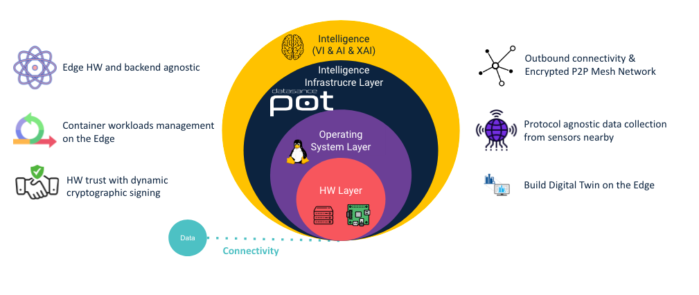
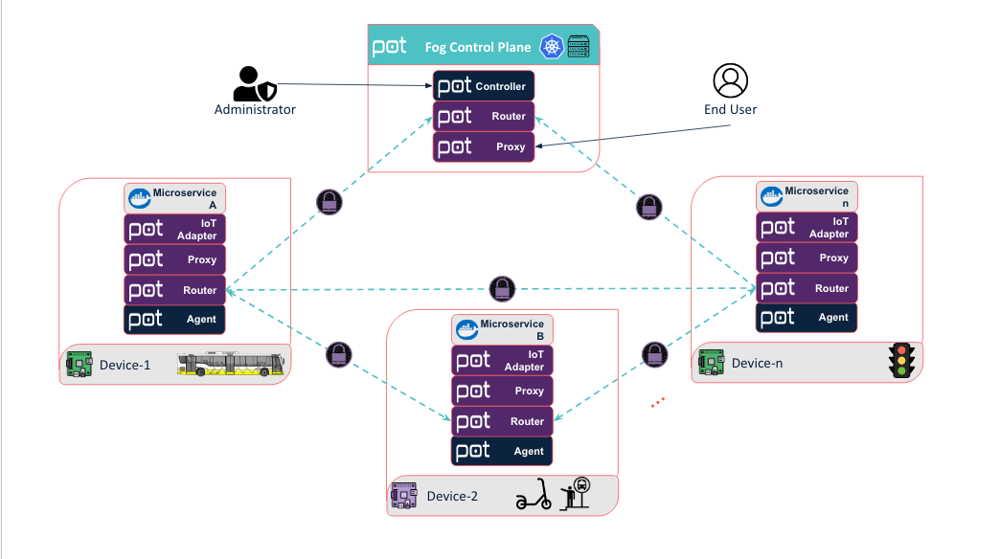
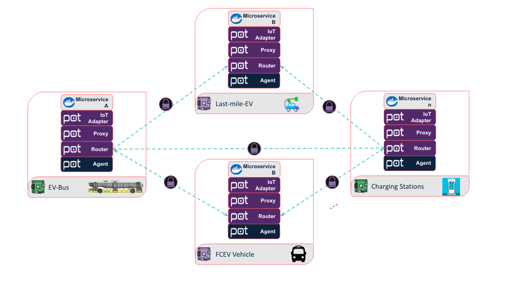

# Welcome to the Documentation Page for Datasance PoT!

By leveraging the power of Open Source communities, Datasance PoT brings Hardware Trust, Cloud-Native computing capabilities, Management at scale, and True connectivity to the Edge. Datasance PoT is an Enterprise Open Source Fog Computing and Distributed Edge Intelligence Platform. 

Datasance is focusing on to build ecosystem with solution partners to build Web3.0 and Digital Twin enabled industries for more efficient,  sustanaible and carbon neutral future.

Datasance PoT can be deployed anywhere that data is generated and operation is crucial. Industry 4.0, Samrt Cities, Intelligent Transport & Logistics, Healthcare, Finance & Retail, there are millions of use case scenarios that can be build with Datasance PoT. 

