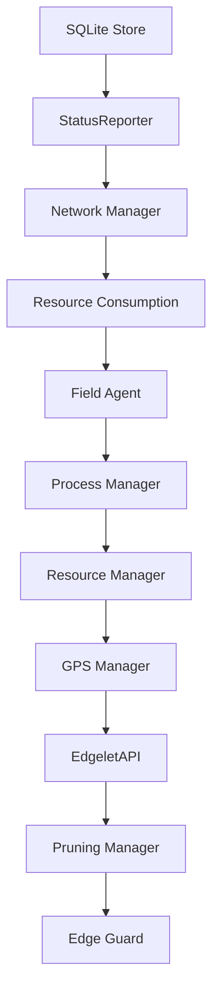

# Edgelet architecture

## Overview

Edgelet is the edge runtime for the PoT platform. On **linux**, production ships a **two-layer** binary:

| Layer | Path | Role |
| ----- | ---- | ---- |
| **Thin** | `/usr/local/bin/edgelet` | Download/OTA binary: `go:embed` zstd bundle, extract orchestration, **all operator CLI** (EdgeletAPI client), `version` / help |
| **Fat** | `/var/lib/edgelet/data/current/bin/edgelet` | Runtime ELF: supervisor, field agent, process manager, EdgeletAPI server, in-process containerd |

`edgelet daemon` (including systemd) starts at the **thin** entry. When `containerEngine: edgelet`, the thin process lazy-extracts the embedded bundle, then `exec`s the **fat** binary with the same arguments. Operator commands (`edgelet ms …`, `edgelet deploy …`, etc.) run **in the thin process** and do not require extract.

On **darwin** and **windows**, Edgelet is a **single monolithic** binary: CLI + daemon, no embed, no two-layer split. Only `docker` or `podman` engines are supported on desktop.

The supervisor maintains bidirectional sync with the Controller, reconciles desired microservice state against a pluggable container engine, and exposes the on-device **EdgeletAPI** for local administration.

All container operations go through a `ContainerEngine` interface (`edgelet`, `docker`, or `podman`). On linux, all three engines are linked into one binary; selection is **runtime** via `containerEngine` in config.

## Linux thin vs fat dispatch

1. **Thin entry** at `/usr/local/bin/edgelet` handles CLI subcommands via EdgeletAPI client.
2. **`edgelet daemon`** with `containerEngine: edgelet` extracts the zstd bundle if needed, then execs the fat binary.
3. **`edgelet daemon`** with `docker` or `podman` connects to the host engine socket (no extract).
4. **Lazy extract:** after a thin upgrade, a new embed hash unpacks to `/var/lib/edgelet/data/<hash>/`, then rotates `data/current` and `data/previous` symlinks.

**Break-glass:** operators may invoke the fat runtime directly, e.g. `/var/lib/edgelet/data/current/bin/edgelet daemon`, bypassing thin dispatch (useful for debugging).

## Module layout

```
cmd/edgelet/              # Thin entry (linux): CLI + embed + daemon dispatch
                          # Monolithic entry (darwin/windows): CLI + daemon
cmd/edgelet-server/       # Fat entry (linux only): daemon + containerd child
internal/
  auth/                   # JWT, TLS, EdgeletAPI PKI and token lifecycle
  config/                 # YAML config load/save, SIGHUP reload
  edgeletapi/             # EdgeletAPI HTTP/WebSocket server (:54321)
  fieldagent/             # Controller communication and sync
  processmanager/         # Container reconciliation loop
  statusreporter/         # Status aggregation
  store/                  # SQLite persistence
  supervisor/             # Root orchestrator - module start/stop order
  volumemount/            # Secret / ConfigMap volume lifecycle
pkg/engine/               # ContainerEngine interface (edgelet / docker / podman)
```

## Module startup order

The **Supervisor** opens SQLite, then starts modules in dependency order. Embedded containerd (when `containerEngine=edgelet`) must be running before the supervisor starts.



Approximate sequence:

1. Open `store` (`/var/lib/edgelet/edgelet.db`)
2. `statusreporter` — aggregates module status for Controller POST
3. `network` — host interface management
4. `resourceconsumption` — host resource sampling
5. `fieldagent` — Controller REST client and sync workers
6. `processmanager` — container reconcile (after engine wired)
7. `resourcemanager` — edge resource bookkeeping
8. `gps` — NMEA/device integration
9. `edgeletapi` — HTTPS + Unix `/v1/...`
10. `pruning` — scheduled image prune
11. `edgeguard` — hardware attestation loop

Lazy or engine-bound components (not separate supervisor `Start()` modules): `volumemount`, `dnsresolver`, `healthcheck`, `proxy`, `runtimeapi`, `serviceaccount`.

### StatusReporter module indices

`GET /v1/system/status` exposes `modulesStatus[]` with these indices:

| Index | Module |
| ----- | ------ |
| 0 | Resource Consumption Manager |
| 1 | Process Manager |
| 2 | Status Reporter |
| 3 | EdgeletAPI |
| 4 | Field Agent |
| 5 | Resource Manager |
| 6 | GPS Manager |

## EdgeletAPI

The **EdgeletAPI** is the daemon↔CLI HTTPS/WebSocket surface on the Edgelet node. It is **not** the Controller REST API.

| Item | Value |
| ---- | ----- |
| Port | `54321` (TLS) |
| Route prefix | `/v1/...` |
| CLI bearer token | `/etc/edgelet/edgelet-api` |
| TLS trust | `/etc/edgelet/edgeletapi-ca.crt` |
| Unix socket (CLI) | `/run/edgelet/edgelet.sock` |
| JWT `tokenUse` | `edgeletapi` |
| JWT `aud` | `edgelet://edgeletapi/v1` |

Route groups include `/v1/system/*`, `/v1/ms/*`, `/v1/deploy/*`, `/v1/auth/*`, and `/v1/images/*`. See [EdgeletAPI v1](/edgelet/edgelet-api) for the full route reference.

## Controller API

The **Field Agent** talks to the remote Controller over HTTPS. Controller REST paths remain under `/api/v3/...`. This is separate from EdgeletAPI `/v1/...` on localhost.

The field agent polls for configuration changes, loads microservices/registries/volume mounts into SQLite, and posts aggregated status back to the Controller.

## Container engines (by platform)

| Platform | Allowed `containerEngine` | Default | Binary layout |
| -------- | ------------------------- | ------- | ------------- |
| **linux** | `edgelet`, `docker`, `podman` | `edgelet` | Thin + fat-in-tar when using `edgelet` |
| **darwin / windows** | `docker`, `podman` | `docker` | Monolithic |

See [Deployment](/edgelet/deployment) for engine selection and config.

## DNS (embedded engine)

Linux deployments with `containerEngine: edgelet` run an embedded authoritative DNS subsystem on the bridge gateway for `svc.bridge.local` service discovery.

Edgelet node DNS name: `edgelet.default.svc.bridge.local`. See [DNS & discovery](/edgelet/dns).

## Persistence

| Path | Purpose |
| ---- | ------- |
| `/etc/edgelet/config.yaml` | Active configuration |
| `/etc/edgelet/edgelet-api` | EdgeletAPI CLI bearer token (auto-created) |
| `/etc/edgelet/edgeletapi-*.crt/key` | EdgeletAPI TLS PKI |
| `/var/lib/edgelet/` | User data, volume mounts, SQLite |
| `/var/lib/edgelet/data/<hash>/` | Extracted zstd bundle (fat binary, shim, crun, CNI, pause image) |
| `/var/lib/edgelet/data/current` | Symlink → active `<hash>/` directory |
| `/var/lib/edgelet/data/previous` | Symlink → prior bundle (rollback reference) |
| `/var/lib/edgelet-containerd/` | Containerd state (edgelet engine) |
| `/var/run/edgelet/` | Runtime sockets and PID files |
| `/var/log/edgelet/` | Rotated daemon logs |

SQLite stores cached microservices, registries, and volume mount records. See [Persistence](/edgelet/persistence) for backup and restore.

## Release OTA (two layers)

Fleet upgrades use **two coordinated layers**. See [Installation](/edgelet/installation).

| Layer | Owner | Metadata |
| ----- | ----- | -------- |
| **Thin binary** | `install.sh` | `/var/backups/edgelet/install-receipt`, `previous-release`, `cache/` |
| **Fat bundle** | Daemon extract | `data/current`, `data/previous` symlinks |

Controller heartbeat exposes `readyToUpgrade` / `readyToRollback` when the install script and receipt state allow OTA. Container deployments (`EDGELET_DAEMON=container`) use image-tag rollout only.

## Key data flow - microservice deploy

1. Controller signals changes via `/api/v3/.../changes`.
2. Field agent fetches microservice definitions from Controller.
3. Process manager updates desired state and calls the container engine (pull / create / start).
4. Field agent posts status back to Controller.

## See also

- [Installation](/edgelet/installation) - OTA layers and readiness
- [Deployment](/edgelet/deployment) - production topology
- [Configuration reference](/edgelet/configuration-reference) - every config key
- [Deploy manifests](/edgelet/deploy-manifests) - local `edgelet deploy` YAML
- [Workload continuity](/edgelet/workload-continuity) - control vs data plane restart
- [Control plane on node](/edgelet/control-plane) - local Controller deployment

import EditPageAdmonition from '@site/src/components/EditPageAdmonition';

<EditPageAdmonition />
