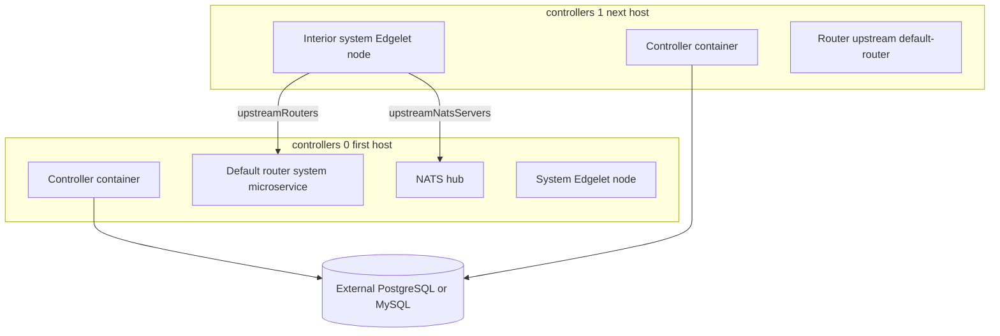

import Link from '@docusaurus/Link';
import CliBlock from '@site/src/components/CliBlock';
import CliName from '@site/src/components/flavor/CliName';
import { CLI_DOCS_DIR, CLI_NAME } from '@site/src/config/distribution';
import EditPageAdmonition from '@site/src/components/EditPageAdmonition';

# Multi-controller HA

This page is how <CliName /> deploys `kind: ControlPlane` across multiple hosts: shared configuration, the database rule, parallel Edgelet rollout, global certificate upload, and system Edgelet nodes in list order.

The deploy command and single-host example are on [Remote](/learn/control-plane/remote). Adding one host later is the [Controller add-on](/learn/control-plane/controller-add-on).

## What each host runs

Each `spec.controllers[]` entry is a physical or virtual machine that runs:

1. Edgelet.
2. A Controller container from the translated Edgelet `ControlPlane` manifest. Every host gets the same global auth, database, and image spec.
3. A system Edgelet node (`isSystem: true`). That node deploys Router and, when enabled, NATS as system microservices from `spec.systemMicroservices`.

This is a multi-node Edgelet layout: one Controller process per host. It is not the Kubernetes model of one custom resource and several pod replicas. When you run more than one controller host, those processes share an external database.

## Database

| `controllers[]` length | Database |
| ---------------------- | -------- |
| 1 | `spec.database` is optional. A single Controller may use embedded SQLite on Edgelet. |
| 2 or more | `spec.database.provider` is required, with host, port, user, password, and databaseName. |

Validation rejects multiple controllers without an external database. The same rule applies when you add a host with `kind: Controller` and the stored control plane still has one controller and no external database.

Supported providers: `postgres` and `mysql`.

Every Controller container uses the same `spec.database` settings. Failover behavior depends on how you run the Controller and the database, outside this CLI.

## Endpoint and URLs

| Field | Role |
| ----- | ---- |
| `spec.endpoint` | Primary address <CliName /> waits on for the Controller API |
| `spec.controller.publicUrl` | Public URL written into Edgelet environment. When both are set, they match. |
| Per-controller `endpoint` | May be recorded after deploy for that host's API address |

Use HTTPS URLs that match `spec.tls` and `spec.ca`. See [Securing a remote control plane](/learn/security/control-plane-remote).

## Phase 1: parallel, per host

For each `spec.controllers[]` entry, at the same time:

1. SSH preflight (reachable host, key, user).
2. Edgelet install (native or container, from the system Edgelet node config).
3. Airgap checks when `spec.airgap` or `controllers[].airgap` is set. That controller needs `systemAgent.config.arch`.
4. Private Edgelet registry manifest when `spec.controller.package` has registry, username, and password.
5. Translate the global spec plus this controller row into Edgelet YAML.
6. `edgelet deploy -f` on that host. <CliName /> polls until the Controller is running.

No Controller API login happens until every host completes this phase, or one fails.

## Phase 2: once per namespace

After every host succeeds and namespace config is saved:

1. Wait for the Controller API at the global endpoint or public URL.
2. When `auth.mode` is `embedded`, bootstrap and create `iofogUser` if it is missing.
3. Register a pull registry on the Controller when private `controller.package` credentials were used.
4. Upload global certificates when any of `routerSiteCA`, `routerLocalCA`, `natsSiteCA`, or `natsLocalCA` is set. The Controller stores TLS secrets and CA catalog entries under the operator-aligned names. See [Securing a remote control plane](/learn/security/control-plane-remote). This step is skipped when every block is empty.
5. Fill console URL on the stored control plane when it is still empty.

## Phase 3: system Edgelet nodes, in order

System Edgelet nodes are deployed in `controllers[]` order, not in parallel.

### Index 0

- `isSystem: true`
- `upstreamRouters`: empty (default router on this node)
- `upstreamNatsServers`: empty (NATS hub on this node when NATS is enabled)

This host anchors `default-router` and `default-nats-hub`.

### Index 1 and later

- `isSystem: true`
- `upstreamRouters` includes `default-router` (appended if you supply a partial list)
- `upstreamNatsServers` includes `default-nats-hub`

Interior Edgelet nodes connect messaging to the resources registered on the first host.

### Each index

1. Deploy the Edgelet node config to the Controller API.
2. Edgelet on that host is already installed from phase 1.
3. Point Edgelet at the controller URL and provision it with the system key.
4. Save the Edgelet node UUID and SSH metadata in namespace config.

When `systemAgent` is `{}`, deployment type is native, `isSystem` is true, and arch may default to `auto` on remote when config is omitted. Airgap still requires `arch`.

## NATS

When `spec.nats.enabled` is true, images under `systemMicroservices.nats` must be set. <CliName /> fills defaults from the build tags when you omit them. The first host runs NATS. Later hosts reference `default-nats-hub`.

## Airgap {#airgap}

When airgap is enabled globally or on a controller:

- `systemAgent.config.arch` is required for that controller.
- Images and the Edgelet binary are staged from the CLI cache before the SSH transfer.

See [Airgap deployment](/get-started/deploy/airgap-deployment).

## When a step fails

| Situation | What happens |
| --------- | ------------ |
| A host fails during Edgelet deploy | The parallel phase fails. Global auth, CA upload, and system Edgelet nodes do not run. |
| The index 0 system Edgelet node fails | Later indexes are not provisioned. |
| A second controller is added without an external database | Validation rejects the file. |
| Duplicate controller `name` or `host` | Validation rejects the file. |

## Compared with Kubernetes

| Topic | KubernetesControlPlane | Remote ControlPlane |
| ----- | ---------------------- | ------------------- |
| Unit of scale | `replicas.controller`, NATS StatefulSet replicas | `controllers[]` hosts |
| Database | `spec.database` on the user file, translated to the custom resource | Global `spec.database` |
| Router and NATS TLS | Operator Secrets in the namespace | CA names created through the Controller API, plus system microservices on Edgelet |
| Messaging topology | Operator registers the default router and NATS hub | First and later system Edgelet nodes, with upstream lists |

## Day-2

Status after deploy is on [Overview](/get-started/edgeops-console/overview), under **Cluster controllers** (Active, Standby, or Stale). That block does not open a detail panel.

<CliBlock>{`{{CLI_NAME}} describe controlplane
{{CLI_NAME}} describe controller CONTROLLER_NAME`}</CliBlock>

- <Link to={`/${CLI_DOCS_DIR}/${CLI_NAME}_describe_controlplane`}>describe controlplane</Link>
- <Link to={`/${CLI_DOCS_DIR}/${CLI_NAME}_describe_controller`}>describe controller</Link>

Image and Edgelet pins move with [Upgrade the platform train](/learn/control-plane#upgrade-the-platform-train). Deploy the full `ControlPlane` file again after you edit it. Plan index 0 as the primary router and NATS host. Adding a controller does not reorder that host. Use the [Controller add-on](/learn/control-plane/controller-add-on) when the global spec is already stored.

## Related

- [Remote ControlPlane fields](/reference/yaml/remote-control-plane)
- [Securing a remote control plane](/learn/security/control-plane-remote)

<EditPageAdmonition />
