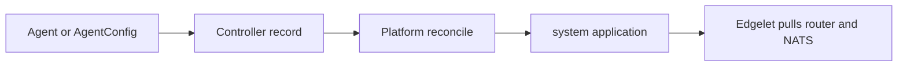

import Link from '@docusaurus/Link';
import CliBlock from '@site/src/components/CliBlock';
import FlavorYaml from '@site/src/components/FlavorYaml';
import CliName from '@site/src/components/flavor/CliName';
import ProductName from '@site/src/components/flavor/ProductName';
import { CLI_DOCS_DIR, CLI_NAME } from '@site/src/config/distribution';
import EditPageAdmonition from '@site/src/components/EditPageAdmonition';

# Networking

<ProductName /> builds the router and NATS fabrics from declarative config. You set router and NATS roles on an **Edgelet node** (`Agent`, `LocalAgent`, or `AgentConfig`). Controller platform reconcile then creates the system application, the `router` and `nats` microservices, certificate authorities, TLS material, configs, and upstream links.

You do not install fabric CAs, write router JSON or NATS config, or copy JWT bundles by hand.

| Fabric | Node fields | System microservice | User-facing layer |
| ------ | ----------- | ------------------- | ----------------- |
| Service interconnection (AMQP router) | `routerConfig`, `upstreamRouters` | `system-<agentName>/router` | [Services](/learn/network/services) add TCP bridges |
| Messaging (NATS) | `natsConfig`, `upstreamNatsServers` | `system-<agentName>/nats` | [Applications](/learn/workloads/applications) `natsAccess`, [NATS account rules](/learn/message-bus/account-rules), [NATS user rules](/learn/message-bus/user-rules) |

Field tables are on [AgentConfig fields](/reference/yaml/agent-config). Deploy order is on [Edgelet nodes](/learn/edgelet-nodes#two-deploy-phases).

## Declare, then the platform builds



1. <CliName /> `deploy` sends the configuration. It resolves `upstreamRouters` and `upstreamNatsServers` from Edgelet node names to UUIDs.
2. Create returns the node UUID. Provisioning continues in the background.
3. The Controller flags the node. Edgelet applies the `system-<agentName>` workloads.

System applications such as `system-<agentName>` are created by the platform. Operators inspect them. They do not deploy them as user applications. See [Applications](/get-started/workloads/applications).

<CliBlock>{`{{CLI_NAME}} get system-microservices -n my-ecn
{{CLI_NAME}} describe system-microservice system-plant-a/router -n my-ecn
{{CLI_NAME}} describe system-microservice system-plant-a/nats -n my-ecn
{{CLI_NAME}} reconcile agent plant-a -n my-ecn`}</CliBlock>

- <Link to={`/${CLI_DOCS_DIR}/${CLI_NAME}_get`}>get</Link>
- <Link to={`/${CLI_DOCS_DIR}/${CLI_NAME}_describe`}>describe</Link>
- <Link to={`/${CLI_DOCS_DIR}/${CLI_NAME}_reconcile`}>reconcile</Link>

Stuck platform reconcile is covered in [Reconcile](/get-started/edgelet-nodes/reconcile).

## Defaults on a typical edge node

| Setting | Default | Meaning |
| ------- | ------- | ------- |
| `routerConfig.routerMode` | `edge` | Workload node. It dials interior routers. |
| `natsConfig.natsMode` | `leaf` | Local NATS. It dials hub servers on port 7422. |
| `upstreamRouters` | omit | `default-router` plus every system-node router |
| `upstreamNatsServers` | omit | `default-nats-hub` plus every system-node NATS server |

<FlavorYaml title="edge-leaf.yaml">

```yaml
apiVersion: {{API_VERSION}}
kind: Agent
metadata:
  name: plant-a
  namespace: my-ecn
spec:
  host: 203.0.113.10
  ssh:
    user: ubuntu
    keyFile: ~/.ssh/id_rsa
  package:
    version: "1.1.0"
  config:
    host: 203.0.113.10
    arch: amd64
    routerConfig:
      routerMode: edge
      messagingPort: 5671
    natsConfig:
      natsMode: leaf
      natsServerPort: 4222
      natsLeafPort: 7422
      jsStorageSize: 10g
      jsMemoryStoreSize: 1g
```

</FlavorYaml>

Omitting the upstream lists attaches this node to `default-router` and `default-nats-hub`, plus fabrics on system Edgelet nodes.

An interior router and a NATS server on a later node need explicit ports. See [Router fabric](/learn/edgelet-nodes/router-fabric) and [NATS fabric](/learn/edgelet-nodes/nats-fabric).

## Control plane kind

| | Remote or local control plane | Kubernetes control plane |
| --- | ----------------------------- | ------------------------ |
| First node in an empty cluster | Becomes the system Edgelet node. The Controller forces `routerMode: interior` and `natsMode: server`. | You cannot create a system Edgelet node through the node API. The platform router and NATS are the hub. |
| Hub | The first system node is `default-router` and the NATS hub. See [Remote networking](/learn/control-plane/remote#networking) and [Local networking](/learn/control-plane/local#networking). | Operator Deployment `router` and StatefulSet `nats`, then registered with the Controller. See [Kubernetes networking](/learn/control-plane/kubernetes#networking). |
| Later nodes | Roles you set. Omitted roles are `edge` and `leaf`. | Usually `edge` and `leaf`. Extra `server` nodes join hub cluster routes. |

System nodes on control plane hosts are `controllers[].systemAgent` or `spec.systemAgent`, not user `kind: Agent`. See [Edgelet nodes](/learn/edgelet-nodes#system-node-on-the-control-plane).

## Fabric CAs and catalog certificates

[Certificates](/learn/config/certificates) (`kind: CertificateAuthority` and `kind: Certificate`) are catalog resources for workload TLS.

Router and NATS use separate CAs created during platform reconcile: `router-site-ca`, `default-router-local-ca`, `nats-site-ca`, and `default-nats-local-ca`. The Controller issues and mounts those certificates. You do not name them in node YAML.

## What you declare

| You set | The platform does |
| ------- | ----------------- |
| `routerMode`, `natsMode`, and `host` | Installs router and NATS CAs and issues per-node certificates |
| Node config, or a [Service](/learn/network/services) | Writes router config and NATS `server.conf` or leaf config |
| `upstreamRouters` and `upstreamNatsServers`, or the defaults | Wires upstream links |
| Application `natsAccess` and [NATS rules](/learn/message-bus/account-rules) | Places account JWTs on NATS nodes |
| `kind: Service` | Opens Service TCP bridges in the router config |

## Fabric pages

| Page | Contents |
| ---- | -------- |
| [Router fabric](/learn/edgelet-nodes/router-fabric) | `routerMode`, TLS, listeners, connectors, Service bridges |
| [NATS fabric](/learn/edgelet-nodes/nats-fabric) | `natsMode`, JetStream, server and leaf, resolver bundles |

<EditPageAdmonition />
