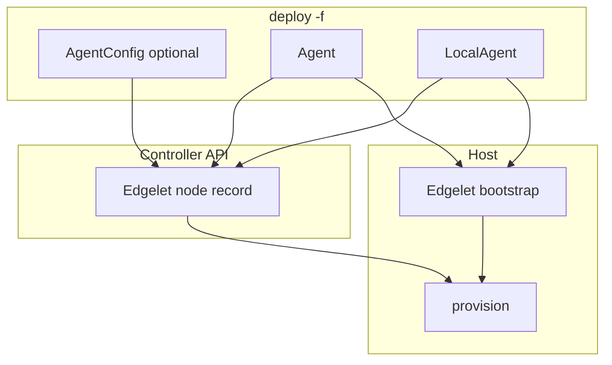

import Link from '@docusaurus/Link';
import CliBlock from '@site/src/components/CliBlock';
import CliName from '@site/src/components/flavor/CliName';
import ProductName from '@site/src/components/flavor/ProductName';
import { CLI_DOCS_DIR, CLI_NAME } from '@site/src/config/distribution';
import EditPageAdmonition from '@site/src/components/EditPageAdmonition';

# Edgelet nodes

An **Edgelet node** is a member of a <ProductName /> cluster. It runs Edgelet, receives workloads, and joins the router and NATS fabrics. These pages cover the YAML kinds, the bootstrap pipeline, and how the Controller builds those fabrics.

A [control plane](/learn/control-plane) must already exist in the namespace. Edgelet as a standalone engine is documented under [Edgelet](/learn/edgelet).

## Three kinds

| Kind | Use |
| ---- | --- |
| `Agent` | Production Edgelet node. <CliName /> reaches the host over SSH and bootstraps Edgelet. See [Remote node](/learn/edgelet-nodes/remote). |
| `LocalAgent` | Edgelet on the machine where <CliName /> is running. This is an extra local node. The control plane system node is a different object. See [Local node](/learn/edgelet-nodes/local) and [`spec.systemAgent`](/learn/control-plane/local#networking) on a local control plane. |
| `AgentConfig` | Controller record only. No host bootstrap. See [AgentConfig](/learn/edgelet-nodes/agent-config). |

User YAML uses the flavor `apiVersion`. Examples on these pages use `<FlavorYaml>` so the group and image registry match the site you are reading. The deploy command is <Link to={`/${CLI_DOCS_DIR}/${CLI_NAME}_deploy`}>deploy</Link> with `-f`.

<CliBlock>{`{{CLI_NAME}} deploy -f agents.yaml -n my-ecn`}</CliBlock>

Say **Edgelet node** in the console and in these guides. The YAML kind stays `Agent`.

## Component pairing (v3.9.0)

| Component | Version |
| --------- | ------- |
| <CliName /> | v3.9.0 |
| Edgelet (binary or image) | v1.1.0 (image tag `1.1.0`) |

Controller, operator, Router, and NATS pins for this train are on [Control plane](/learn/control-plane#default-image-pins-v390).

Host architecture values used at deploy are `amd64`, `arm64`, `arm`, `riscv64`, and `auto` where that value is accepted.

## Two deploy phases

`deploy -f` separates the Controller record from the host install.



For an `Agent` or `LocalAgent` in one file:

1. **AgentConfig phase.** Explicit `kind: AgentConfig` documents run against the Controller API first. For each `Agent` or `LocalAgent` with no matching AgentConfig, <CliName /> synthesizes one from `spec.config`, the node name, and the host. Matching is by `metadata.name`. When names match, host and tags from the node spec are merged into that AgentConfig.
2. **Host phase.** <CliName /> bootstraps Edgelet, may update AgentConfig again when `spec.config` is set, runs `edgelet config` and `edgelet provision`, and stores the node in the CLI namespace config (`~/.iofog/v3`).

`upstreamRouters` and `upstreamNatsServers` are Edgelet node **names** in YAML. <CliName /> resolves them to UUIDs at deploy time. The upstream node must already exist on the Controller. Deploy it first, or put its AgentConfig in the same file before the node that names it.

One file may also contain a control plane, volumes, and applications. Node deploy runs only after control plane executors succeed. `metadata.namespace`, when set, must match `-n`.

## System node on the control plane

The system Edgelet node on a Controller host is not `kind: Agent`. Declare it in control plane YAML:

| Control plane | YAML path |
| ------------- | --------- |
| Remote `ControlPlane` | `controllers[].systemAgent` |
| `LocalControlPlane` | `spec.systemAgent` |

Bootstrap runs when that host is prepared. The later system-node step only pushes AgentConfig and provisions. It does not bootstrap Edgelet again. Config fields for that record are the same shape as [AgentConfig fields](/reference/yaml/agent-config). Scripts live on the control plane object. See [Remote](/learn/control-plane/remote) and [Local](/learn/control-plane/local).

## Console

Open [Nodes](/get-started/edgeops-console/nodes). The pages are **Edgelet List**, **Edgelet Map**, and **Mesh Graph**. The first SSH install is a CLI deploy. After the node exists, the console and <CliName /> share the Controller API.

## Procedures

Get started already has the operator steps. Use these links. Do not treat this section as a second copy.

| Procedure | Guide |
| --------- | ----- |
| Install on a host | [Setup Edgelet nodes](/get-started/deploy/setup-edgelet-nodes) |
| Config push | [Configuration updates](/get-started/edgelet-nodes/configuration-updates) |
| EdgeGuard | [EdgeGuard](/get-started/edgelet-nodes/edgeguard) |
| Attach and detach | [Attach and detach](/get-started/edgelet-nodes/attach-detach) |
| Volumes | [Volume distribution](/get-started/edgelet-nodes/volume-distribution) |
| Prune | [Image pruning](/get-started/edgelet-nodes/image-pruning) |
| Upgrade and rollback | [Upgrade and rollback](/get-started/edgelet-nodes/upgrade-rollback) |
| Reconcile | [Reconcile](/get-started/edgelet-nodes/reconcile) |
| Logs and exec | [Node logs and exec](/learn/operate/node-debugging) |
| Console screens | [Nodes](/get-started/edgeops-console/nodes) |

Day-2 verbs are summarized on [Lifecycle](/learn/edgelet-nodes/lifecycle).

## EdgeGuard {#edgeguard}

`edgeGuardFrequency` on the node config is the scan interval in seconds. `0` disables scans. What a signature change does, and how to turn scans on, is in [EdgeGuard](/get-started/edgelet-nodes/edgeguard). The field is listed on [AgentConfig fields](/reference/yaml/agent-config).

## Upgrade and rollback Edgelet {#upgrade-and-rollback-edgelet}

Fleet nodes move to Edgelet **v1.1.0** with `upgrade agent` after the control plane is healthy. Rollback uses the same flow with the previous version. Steps and workload impact are in [Upgrade and rollback](/get-started/edgelet-nodes/upgrade-rollback).

## Attach, detach, and move {#attach-detach-and-move}

Detach removes the Controller record and keeps Edgelet on the host so you can attach the node again. Move is that transfer across namespaces. Commands, delete, and SSH cache updates are in [Attach and detach](/get-started/edgelet-nodes/attach-detach).

## Service distribution tags

To receive local TCP bridge listeners for a [Service](/learn/network/services), tag the node or its AgentConfig with the distribution prefix and the token:

```yaml
metadata:
  tags:
    - "service.iofog.org/tag: checkout"
    - "service.iofog.org/tag: all"
```

`checkout` matches a Service whose `metadata.tags` includes `checkout`. The `all` token matches every Service.

## Guides

| Page | Contents |
| ---- | -------- |
| [Remote node](/learn/edgelet-nodes/remote) | `kind: Agent` |
| [Agent fields](/reference/yaml/agent) | SSH, package, scripts, `spec.config` |
| [Local node](/learn/edgelet-nodes/local) | `kind: LocalAgent` |
| [LocalAgent fields](/reference/yaml/local-agent) | Local host fields and `spec.config` |
| [AgentConfig](/learn/edgelet-nodes/agent-config) | Controller record only |
| [AgentConfig fields](/reference/yaml/agent-config) | `spec` configuration |
| [Bootstrap](/learn/edgelet-nodes/bootstrap) | Install layers and custom scripts |
| [Lifecycle](/learn/edgelet-nodes/lifecycle) | Day-2 verbs |
| [Networking](/learn/edgelet-nodes/networking) | Router and NATS from declarative config |
| [Router fabric](/learn/edgelet-nodes/router-fabric) | `routerMode`, listeners, upstreams |
| [NATS fabric](/learn/edgelet-nodes/nats-fabric) | `natsMode`, leaf, server, JetStream |

<EditPageAdmonition />
