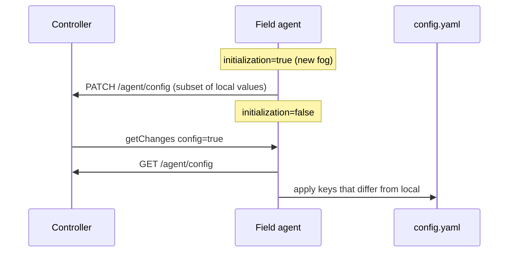

import EditPageAdmonition from '@site/src/components/EditPageAdmonition';

# Configuration

Operator reference for **`/etc/edgelet/config.yaml`** (paths on darwin/windows: [Installation](/learn/edgelet/installation)). This file configures the **field agent** (Controller client, engine, limits, logging, GPS, Edge Guard). It is **not** the same as deploy manifests (`ControlPlane`, `Microservice`, ...). See [Manifests](/learn/edgelet/manifests).

**Related:** [Edgelet API](/learn/edgelet/api) (`GET/PATCH /v1/system/config`), CLI [edgelet config](/reference/cli/edgelet/edgelet_config), [Engine lifecycle](/learn/edgelet/engine-lifecycle), [Workload continuity](/learn/edgelet/workload-continuity), [EdgeGuard](/learn/edgelet/edgeguard), [Local control plane](/learn/edgelet/control-plane) (`controllerUrl` vs local ControlPlane).

---

## File layout

```yaml
currentProfile: production   # active profile name
profiles:
  production:                  # flat string key/value map
    controllerUrl: "https://controller.example.com/api/v3/"
    containerEngine: edgelet
    # ...
  development:
    devMode: "on"
    # ...
```

| Concept | Behavior |
|---------|----------|
| **Profiles** | Named property sets; only `currentProfile` is active at runtime. |
| **Property types** | Stored as strings in YAML; parsed to numbers/bools on load. |
| **Booleans in YAML** | Often `"on"` / `"off"` (e.g. `watchdogEnabled`, `devMode`, `secureMode`). CLI/API use JSON booleans where applicable. |
| **First install** | Sample from packaging or `edgelet init-config` (does not overwrite existing file). |

---

## How settings are changed

| Channel | When to use |
|---------|-------------|
| **Edit YAML + reload** | Bulk or GitOps-style changes; `edgelet system reload` or `POST /v1/system/reload` (SIGHUP-style). Invalid changes are rejected and do not corrupt on-disk YAML. |
| **`edgelet config ...`** | Same keys as `PATCH /v1/system/config`; persists to active profile and triggers in-process reload when successful. |
| **`edgelet config switch <profile>`** | Sets `currentProfile` only (`POST /v1/system/config/switch`). |
| **`edgelet config cert ...`** | Installs Controller CA PEM (path written to `controllerCert`). |
| **Controller fleet config** | After provision, when `getChanges` includes **`config`**: Controller pushes a snapshot; Edgelet applies **diff-only** keys (see below). |

**Credentials** (`iofogUuid`, agent private key) live in **SQLite**, not in editable config. **Proxy / SSH tunnel** settings come from Controller on **`config`** / tunnel changes. Not from `config.yaml`.

---

## Controller sync (provisioned agent)

Edgelet talks to `{controllerUrl}` (Controller-compatible **`/api/v3/agent/...`**).



| Phase | Edgelet behavior |
|-------|------------------|
| **Initialization** | Edgelet **posts** local config to Controller (`PATCH /api/v3/agent/config`). It does **not** pull Controller config until initialization clears via the normal `getChanges` handshake. |
| **Steady state** | On **`config`** change flag: **`GET /api/v3/agent/config`**, map Controller JSON keys to local short codes, apply only **changed** values (`FilterChangedConfigKeys`), persist YAML, reload modules. |
| **GPS coordinates** | Local updates can also **`PATCH /api/v3/agent/config/gps`** with latitude/longitude (derived from `gpsCoordinates` when posting full config). |

**Pull (Controller → Edgelet)**. Keys Edgelet understands when present on `GET config`:

`diskLimit`, `diskDirectory`, `memoryLimit`, `cpuLimit`, `controllerUrl`, `controllerCert`, `containerEngineUrl`, `containerEngine`, `networkInterface`, `logLimit`, `logDirectory`, `logFileCount`, `logLevel`, `statusFrequency`, `changeFrequency`, `watchdogEnabled`, `edgeGuardFrequency`, `gpsMode`, `gpsDevice`, `gpsScanFrequency`, `arch`, `secureMode`, `pruningFrequency`, `availableDiskThreshold`, `upgradeScanFrequency`, `devMode`, `timeZone`.

**Push (Edgelet → Controller)**. Subset sent on `PATCH /api/v3/agent/config` (`postFogConfig`):

`networkInterface`, `containerEngineUrl`, `diskLimit`, `diskDirectory`, `memoryLimit`, `cpuLimit`, `logLimit`, `logDirectory`, `logFileCount`, `statusFrequency`, `changeFrequency`, `watchdogEnabled`, `edgeGuardFrequency`, `gpsDevice`, `gpsScanFrequency`, `gpsMode`, `latitude`, `longitude`, `logLevel`, `availableDiskThreshold`, `pruningFrequency`, `upgradeScanFrequency`.

Not uploaded on that PATCH (remain **local** unless Operator changes them on Controller UI/API and Edgelet **pulls** them): e.g. **`controllerUrl`**, **`controllerCert`**, **`containerEngine`**, **`arch`**, **`secureMode`**, **`devMode`**, **`timeZone`**.

**Conflict rule:** After provision, Controller **pull** can overwrite local values for any mapped pull key. Set `controllerUrl` locally before provision, or manage those fields on Controller if the fleet owns them.

---

## Parameter reference

**Columns:**

| Col | Meaning |
|-----|---------|
| **YAML key** | Name in `profiles.<name>` |
| **CLI / API** | `edgelet config` long flag; `GET/PATCH /v1/system/config` JSON field (API may use suffixed names) |
| **Ctrl pull** | Applied from Controller `GET config` when value differs |
| **Ctrl push** | Sent on agent `PATCH config` during init / post |
| **Default** | Built-in when omitted (see loader) |

### Controller connectivity

| YAML key | CLI / API | Ctrl pull | Ctrl push | Default | Description |
|----------|-----------|-----------|-----------|---------|-------------|
| `controllerUrl` | `--controller-url` / `controllerUrl` | Yes | No | `http://localhost:54421/api/v3/` | Base URL for **`/api/v3/agent/...`**. Must match TLS/trust. Not auto-set by ControlPlane deploy ([Local control plane](/learn/edgelet/control-plane)). |
| `controllerCert` | `--controller-cert` / `controllerCert` | Yes | No | `/etc/edgelet/cert.crt` | Path to PEM CA for Controller HTTPS. Install via `edgelet config cert` or provision flow. Empty allowed for some lab setups. |
| `controllerRequestTimeoutSeconds` | - | No | No | `30` | HTTP timeout for Controller API requests (5-300). **YAML / manual edit only.** |
| `controllerPingTimeoutSeconds` | - | No | No | `60` | Ping worker timeout (5-300). **YAML / manual edit only.** |

### Container runtime

| YAML key | CLI / API | Ctrl pull | Ctrl push | Default | Description |
|----------|-----------|-----------|-----------|---------|-------------|
| `containerEngine` | `--container-engine` / `containerEngine` | Yes | No | `edgelet` (linux), platform-specific on desktop | `edgelet`, `docker`, or `podman`. **Cold change** requires service restart (`pendingRestart`). See [Engine lifecycle](/learn/edgelet/engine-lifecycle). |
| `containerEngineUrl` | `--container-engine-url` / `containerEngineUrl` | Yes | Yes | `unix:///run/edgelet/containerd.sock` | Engine socket/URL (`tcp://` or `unix://`). **Fixed** when `containerEngine=edgelet`. Required for podman when engine is podman. |

### Resource limits (agent stack) {#resource-limits-monitor-vs-enforce}

Host `memoryLimit` and `cpuLimit` raise alarms. They do not set cgroup limits. The engine enforces a microservice `memoryLimit`. See [cgroups](/learn/edgelet/cgroups).

| YAML key | CLI / API | Ctrl pull | Ctrl push | Default | Description |
|----------|-----------|-----------|-----------|---------|-------------|
| `diskLimit` | `--disk-limit-gib` / `diskLimitGiB` | Yes | Yes | `10` | Max disk use for agent data (GiB). 0.5 - platform max. |
| `diskDirectory` | `--disk-directory` / `diskDirectory` | Yes | Yes | `/var/lib/edgelet/` | SQLite, volumes, models, bundles. See [Persistence](/learn/edgelet/persistence). |
| `memoryLimit` | `--memory-limit-mib` / `memoryLimitMiB` | Yes | Yes | `4096` | Memory alarm threshold (MiB). 128 - 1048576. |
| `cpuLimit` | `--cpu-limit-percent` / `cpuLimitPercent` | Yes | Yes | `80` | CPU alarm for Edgelet stack: **5-400** (100 ≈ one logical CPU). |
| `availableDiskThreshold` | `--available-disk-threshold` / `availableDiskThreshold` | Yes | Yes | `20` | Free-disk threshold (GiB) for status/alerts. |

### Logging

| YAML key | CLI / API | Ctrl pull | Ctrl push | Default | Description |
|----------|-----------|-----------|-----------|---------|-------------|
| `logDirectory` | `--log-directory` / `logDirectory` | Yes | Yes | `/var/log/edgelet/` | Agent log files. Legacy alias `logDiskDirectory` accepted on load. |
| `logLimit` | `--log-limit-gib` / `logLimitGiB` | Yes | Yes | `10` | Max log disk (GiB). Legacy alias `logDiskLimit`. |
| `logFileCount` | `--log-file-count` / `logFileCount` | Yes | Yes | `10` | Rotated files (1-100). |
| `logLevel` | `--log-level` / `logLevel` | Yes | Yes | `INFO` | `DEBUG`, `INFO`, `WARN`, `ERROR`, `FATAL`, `OFF`. |
| `logReconcileCycleEveryNTicks` | - | No | No | `60` | Log `reconcile.cycle` at INFO every N monitor ticks when idle. **YAML only.** |

### Polling and maintenance

| YAML key | CLI / API | Ctrl pull | Ctrl push | Default | Description |
|----------|-----------|-----------|-----------|---------|-------------|
| `statusFrequency` | `--status-frequency-seconds` / `statusFrequencySeconds` | Yes | Yes | `10` | Interval (seconds) for status POST to Controller. Must be ≥ 1. |
| `changeFrequency` | `--change-frequency-seconds` / `changeFrequencySeconds` | Yes | Yes | `20` | Interval for `getChanges` poll. Must be ≥ 1. |
| `upgradeScanFrequency` | `--upgrade-scan-frequency` / `upgradeScanFrequency` | Yes | Yes | `24` | OTA / version scan interval (hours). |
| `pruningFrequency` | `--pruning-frequency` / `pruningFrequency` | Yes | Yes | `0` | Hours between image + unused **local model** prune cycles (`0` = off). Does not delete persistent VOLUME data ([Volumes](/learn/edgelet/volumes)). |
| `watchdogEnabled` | `--watchdog-enabled` / `watchdogEnabled` | Yes | Yes | `off` | Orphan container cleanup; local model watchdog. See [Workload continuity](/learn/edgelet/workload-continuity). |

### Network and identity

| YAML key | CLI / API | Ctrl pull | Ctrl push | Default | Description |
|----------|-----------|-----------|-----------|---------|-------------|
| `networkInterface` | `--network-interface` / `networkInterface` | Yes | Yes | `dynamic` | Host interface for status/IP, or `dynamic` / concrete name. Validated against Controller URL when patched via API. |
| `arch` | `--arch` / `arch` | Yes | No | `auto` | Fog type: `auto`, `amd64`, `arm64`, `arm`, `riscv64`. Maps to Controller arch id for image selection. |
| `namespace` | - | No | No | `default` | Local default namespace label context. **YAML only** (not in Controller config sync). |
| `timeZone` | `--timezone` / `timezone` | Yes | No | `Europe/Istanbul` (loader default if empty in file) | Agent timezone string. |

### Security and modes

| YAML key | CLI / API | Ctrl pull | Ctrl push | Default | Description |
|----------|-----------|-----------|-----------|---------|-------------|
| `secureMode` | `--secure-mode` / `secureMode` | Yes | No | `off` | Hardened TLS/verification behavior when on. |
| `devMode` | `--dev-mode` / `devMode` | Yes | No | `off` | Developer diagnostics. |
| `edgeGuardFrequency` | `--edge-guard-frequency` / `edgeGuardFrequency` | Yes | Yes | `0` | Hardware attestation interval (seconds); **`0` disables**. Requires provisioned agent: forced to `0` if unprovisioned when set via CLI. [EdgeGuard](/learn/edgelet/edgeguard). |

### GPS

| YAML key | CLI / API | Ctrl pull | Ctrl push | Default | Description |
|----------|-----------|-----------|-----------|---------|-------------|
| `gpsMode` | `--gps-mode` / `gpsMode` | Yes | Yes | `auto` | `auto`, `dynamic`, `manual`, `off`. |
| `gpsDevice` | `--gps-device` / `gpsDevice` | Yes | Yes | `/dev/ttyUSB0` | Serial device for dynamic GPS. |
| `gpsScanFrequency` | `--gps-scan-frequency` / `gpsScanFrequency` | Yes | Yes | `60` | Scan interval (seconds). |
| `gpsCoordinates` | `--gps-coordinates` / `gpsCoordinates` | No* | Yes† | `0,0` | `lat,lon` string. `POST /v1/system/gps` sets manual coordinates and persists here. †Push sends `latitude`/`longitude` fields, not the raw string. |

\*Controller config JSON may expose latitude/longitude separately on GET; Edgelet maps GPS-related pull keys listed above.

### Shutdown and control-plane stop

| YAML key | CLI / API | Ctrl pull | Ctrl push | Default | Description |
|----------|-----------|-----------|-----------|---------|-------------|
| `shutdownPolicy` | - | No | No | `leave-running` for docker/podman; engine-specific default for `edgelet` | `leave-running` or `drain-all`. Control stop vs workload containers. [Workload continuity](/learn/edgelet/workload-continuity). **YAML only.** |
| `shutdownGracePeriodSeconds` | - | No | No | `90` | Grace for stop/drain paths (5-600). **YAML only.** |

---

## Derived intervals (not in config.yaml)

These are computed at load time. **no YAML keys**:

| Internal setting | Typical value | Role |
|------------------|---------------|------|
| Status report / monitor tick | 5s | Process manager baseline |
| Ping Controller | 30s | Connectivity |
| Registry monitor | 60s | Registry health |
| Healthcheck interval | 30s | Embedded engine healthchecks |
| Reconcile full compare | ~60s | Spec/env drift sweep ([Process manager](/learn/edgelet/modules/processmanager)) |

Do not confuse with **`statusFrequency`** / **`changeFrequency`**. Those are operator-tunable Controller poll intervals.

---

## CLI and API quick reference

```bash
# View effective config (daemon must be running)
edgelet system status -o json    # includes runtime snapshot
# API equivalent: GET /v1/system/config (admin RBAC)

edgelet config --controller-url https://controller.example.com/api/v3/ --change-frequency-seconds 15
edgelet config switch production
edgelet config cert "$(base64 -w0 < ca.pem)"   # platform-specific base64 flags
edgelet system reload
```

`PATCH /v1/system/config` body:

```json
{ "set": { "logLevel": "DEBUG", "changeFrequencySeconds": 15 } }
```

Unsupported keys in `set` return **400** with no partial persist. **`containerEngine`** change may return `"pendingRestart": true`.

OpenAPI `ConfigView` in [OpenAPI contract](/api/v1.1.0/edgelet) is a **subset**; **`GET /v1/system/config`** returns the full operator view (GPS, disk paths, frequencies, etc.).

---

## Removed and forbidden keys

| Key | Status |
|-----|--------|
| `deviceScanFrequency` / CLI `sd` | **Removed**: rejected by `SetConfig` and ignored on Controller pull filter. |
| Legacy `dockerUrl`, `dockerPruningFrequency`, `isolatedDockerContainer` | **Removed**: use `containerEngineUrl`, `pruningFrequency`, `watchdogEnabled`. |

---

## What is not agent config.yaml

| Item | Where it lives |
|------|----------------|
| ControlPlane / Microservice / Registry / Model / Knowledge / RuntimeClass | Deploy manifests: [Manifests](/learn/edgelet/manifests) |
| Controller microservice desired state | Controller REST + SQLite cache after provision |
| Proxy / tunnel | Controller `getChanges` + proxy worker ([Proxy](/learn/edgelet/modules/proxy)) |
| Edge Guard signature baseline | SQLite + `/etc/edgelet/agent-{uuid}.jwt` |
| Local EdgeletAPI admin token | `/etc/edgelet/edgelet-api` |

---

## Validation and reload

- Full config validated on load (`ValidateConfig`): limits, engine/url pairing, GPS format, shutdown policy, log level, etc.
- Failed **`PATCH /v1/system/config`** or CLI update does not write invalid YAML.
- Successful updates persist to the **active profile** and invoke the supervisor reload callback (Field Agent client refresh, engine URL reconnect, DNS, logging).
- **`containerEngine`** family change: quiesce + **`edgelet.service` restart** required. See [Engine lifecycle](/learn/edgelet/engine-lifecycle).

---

## Sample minimal production profile

See packaging sample `edgelet-config.yaml.sample` (install) and [Deployment](/learn/edgelet/deployment) for paths. Example:

```yaml
currentProfile: production
profiles:
  production:
    controllerUrl: "https://controller.example.com/api/v3/"
    controllerCert: "/etc/edgelet/cert.crt"
    containerEngine: edgelet
    containerEngineUrl: unix:///run/edgelet/containerd.sock
    diskDirectory: /var/lib/edgelet/
    logDirectory: /var/log/edgelet/
    logLevel: INFO
    statusFrequency: "10"
    changeFrequency: "20"
    watchdogEnabled: "off"
    shutdownPolicy: leave-running
```

After local ControlPlane deploy, set **`controllerUrl`** to the Controller API endpoint the agent should use, then **provision** ([Local control plane](/learn/edgelet/control-plane#recommended-rollout-system-fog)).

<EditPageAdmonition />
