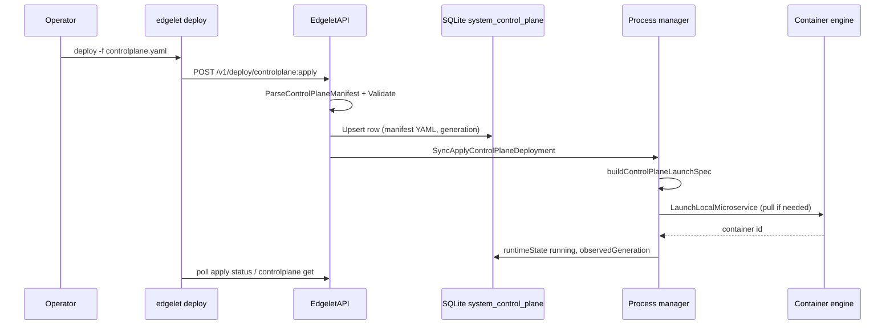
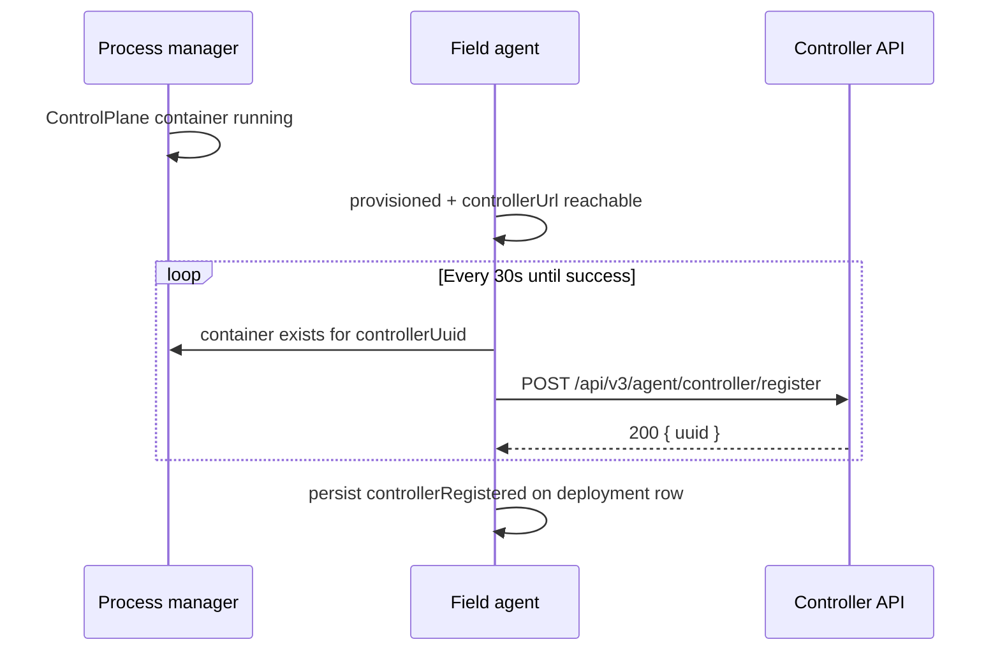

import CliName from '@site/src/components/flavor/CliName';
import EditPageAdmonition from '@site/src/components/EditPageAdmonition';

# Local control plane

This page is the engine manifest: `apiVersion: edgelet.iofog.org/v1` and `kind: ControlPlane`. The user file for a local trial is `kind: LocalControlPlane`. See [Local control plane](/learn/control-plane/local).

Edgelet can host **one** Controller container per node when you apply a `kind: ControlPlane` manifest. There is **no** default controller on install.

## Core rules

- At most **one** controller deployment per Edgelet (SQLite singleton).
- Edgelet may run with `controllerUrl` pointing to a **remote** cluster; local ControlPlane is optional.
- Reconcile runs **before** managed microservices; accidental `docker rm` recreates the container while the DB row exists.
- Only `edgelet controlplane delete` (or `DELETE /v1/system/controlplane`) removes the deployment and its **private** DB/log volumes under `{diskDirectory}/volumes/data/{controller-uuid}/`. Restart keeps those directories. Control-plane volumes are never `scope: shared` and are never dropped by `--purge-volumes`.

## Recommended rollout (system fog)

Use this order when the Controller runs **on the same Edgelet node** via ControlPlane:

1. **Deploy ControlPlane** on Edgelet (`edgelet deploy -f controlplane.yaml`). Wait until `edgelet controlplane get` shows `runtimeState: running`. Edgelet does **not** auto-update `controllerUrl` in config.
2. **Confirm the controller process** listens on the host API port (**51121** by default) and that Console is reachable on host **80** → container console port (default **8008**).
3. **On Controller** (Console or API): create an agent/node (fog) with **`isSystem: true`**, generate a **provision key** for that fog.
4. **On Edgelet**: set `controllerUrl` in config to the Controller API base the agent should use (must match TLS/trust settings), then **`edgelet provision <key>`**.

Registration of the controller workload with Controller (see below) runs **after** provision and only when the local controller container is **running**. The fog **must** be a system fog; registration uses the agent fog token and fails with **403** on non-system fogs.

Remote Controller (`controllerUrl` points elsewhere) without local ControlPlane is valid; registration and microservice-list merge sections apply only when a local ControlPlane row exists.

## ControlPlane manifest (kind overview)

| Field | Value |
|-------|--------|
| `apiVersion` | `edgelet.iofog.org/v1` (required) |
| `kind` | `ControlPlane` (required) |
| `metadata.name` | Required DNS-1123 label (≤63 chars). Drives **`CONTROLLER_NAME`** and bridge DNS; not the Controller microservice list name (see Registration). |
| `metadata.namespace` | Optional; empty → **`default`**. Drives **`CONTROLLER_NAMESPACE`** and bridge DNS. |
| `metadata.labels` | **Forbidden**: validation rejects any labels. |

**Singleton:** at most one ControlPlane deployment per Edgelet (`system_control_plane` in SQLite). Re-apply updates image, env, and related spec on the **same** `controllerUuid`. To change `metadata.name` or `metadata.namespace`, delete the deployment first.

**Required spec (validation):**

- `spec.controller.image`
- `spec.auth.mode`: `embedded` or `external`
- `embedded`: `spec.auth.bootstrap.username` and `spec.auth.bootstrap.password` (password rules: ≥12 chars, 1 uppercase, 1 special)
- `external`: `spec.auth.issuerUrl`, `spec.auth.client.id`, `spec.auth.client.secret`

### Forbidden YAML {#forbidden-yaml}

**Forbidden in YAML:** `spec.siteCA`, `spec.localCA`, legacy keys (`auth.url`, `ecnViewer*`, `spec.https`, old Keycloak fields). Import site/local CA via Controller REST after deploy.

**Annotated example:** [examples/controlplane.yaml](/learn/edgelet/examples/controlplane.yaml).

## How Edgelet applies the manifest



**Create vs patch**

- **Create:** new random `controllerUuid`, `generation` = 1.
- **Patch:** same `controllerUuid`; `generation` increments; `metadata.name` / `metadata.namespace` must match the existing row or apply fails.

**Async apply:** CLI returns **202**, polls until terminal status (default **15** minute budget; override with `edgelet --timeout`). If the CLI times out, the daemon may still be pulling or starting. Use `edgelet controlplane get` or poll `GET /v1/deploy/controlplane:apply/{operationId}`. Avoid immediate duplicate deploy after timeout.

**Reconcile (steady state):** the process manager runs **`reconcileControlPlane()` before** managed microservices when that workload is due. If the SQLite row says the controller should run but the container is missing (for example after manual `docker rm`), Edgelet recreates it. Only `edgelet controlplane delete` or `DELETE /v1/system/controlplane` removes the row and private DB/log volumes.

## YAML → runtime (ports, volumes, labels)

Edgelet builds a **local** microservice launch spec from the manifest. This is separate from the Controller microservice row created at registration.

| Manifest / constant | Runtime behavior |
|---------------------|------------------|
| `spec.controller.image` | Container image; stored on deployment row |
| `spec.controller.registry` | Optional local registry id for pull; if unset, default registry id **2** (`from_cache`) |
| `spec.controller.port` | Container API port; default **51121**. Host port is always **51121** → that container port |
| `spec.console.port` | Container console port; default **8008**. Host port is always **80** → that container port |
| (volumes) | Named volumes `iofog-controller-db` → `/home/runner/.npm-global/lib/node_modules/controller/src/data/sqlite_files/`, `iofog-controller-log` → `/var/log/iofog-controller` under `{diskDirectory}/volumes/data/{controllerUuid}/` (private; never shared scope) |
| `spec.tls.path` | Read-only bind mount of host dir to `/etc/iofog/controller-cert/` (`tls.crt`, `tls.key`, optional `ca.crt`) |
| `spec.tls.base64` | No bind mount; cert material passed via env (see environment table) |
| Capabilities | **`NET_RAW`** always added; container is **not** privileged |
| Network | Bridge (not host network) |
| Labels | `edgelet.iofog.org/system=true`, `role=controller`, plus workload identity labels; scope **local** |
| Container env | `CONTROL_PLANE=Remote` always; see next section |

**Not driven by Controller microservice reconcile for the controller UUID:** the process manager **skips** ADD/UPDATE/DELETE for the microservice whose UUID equals the ControlPlane `controllerUuid`. Lifecycle for that container is owned by the ControlPlane reconciler and dedicated APIs (`controlplane restart`, redeploy YAML, `controlplane delete`).

## YAML → controller container environment

Edgelet sets container environment with `BuildControllerEnv`. Rules:

- **Always set:** `CONTROL_PLANE=Remote`, `CONTROLLER_UUID`, `CONTROLLER_NAMESPACE`, `CONTROLLER_NAME`.
- **Optional blocks:** if a YAML block or field is omitted, Edgelet emits **no** corresponding env vars (except the four identity/plane vars above).
- **Ports:** if `spec.controller.port` / `spec.console.port` are omitted, Edgelet does **not** set `API_PORT` / `CONSOLE_PORT`; defaults **51121** / **8008** still apply via **port mappings**, not env.
- **`spec.console.url`:** set only when non-empty in YAML. Edgelet does **not** copy `spec.controller.publicUrl` into `CONSOLE_URL`.
- **`spec.vault.basePath`:** passed literally; Edgelet does **not** expand `$namespace`. Use the real path or namespace string in YAML.

### Identity (always)

| YAML source | Container env |
|-------------|----------------|
| (generated stable uuid) | `CONTROLLER_UUID` |
| `metadata.namespace` (default `default`) | `CONTROLLER_NAMESPACE` |
| `metadata.name` | `CONTROLLER_NAME` |
| (fixed) | `CONTROL_PLANE` = `Remote` |

### `spec.controller`

| YAML field | Container env | When omitted |
|------------|---------------|--------------|
| `publicUrl` | `CONTROLLER_PUBLIC_URL` | not set |
| `trustProxy` | `TRUST_PROXY` (`true`/`false`) | not set |
| `port` | `API_PORT` | not set; host/container mapping still defaults to 51121 |

### `spec.console`

| YAML field | Container env | When omitted |
|------------|---------------|--------------|
| `port` | `CONSOLE_PORT` | not set; host **80** maps to default 8008 |
| `url` | `CONSOLE_URL` | not set |

### `spec.auth`

| YAML field | Container env |
|------------|----------------|
| `mode` | `AUTH_MODE` |
| `insecureAllowHttp` | `AUTH_INSECURE_ALLOW_HTTP` |
| `insecureAllowBootstrapLog` | `AUTH_INSECURE_ALLOW_BOOTSTRAP_LOG` |
| `bootstrap.username` | `OIDC_BOOTSTRAP_ADMIN_USERNAME` |
| `bootstrap.password` | `OIDC_BOOTSTRAP_ADMIN_PASSWORD` |
| `issuerUrl` | `OIDC_ISSUER_URL` |
| `client.id` | `OIDC_CLIENT_ID` |
| `client.secret` | `OIDC_CLIENT_SECRET` |
| `rateLimit.enabled` | `AUTH_RATE_LIMIT_ENABLED` |
| `rateLimit.maxRequestsPerWindow` | `AUTH_RATE_LIMIT_MAX_REQUESTS` |
| `rateLimit.windowMs` | `AUTH_RATE_LIMIT_WINDOW_MS` |
| `sessionStore.type` | `AUTH_SESSION_STORE_TYPE` |
| `sessionStore.ttlMs` | `AUTH_SESSION_STORE_TTL_MS` |
| `sessionStore.secret` | `AUTH_SESSION_SECRET` |
| `tokenTtl.accessTokenTtlSeconds` | `AUTH_ACCESS_TOKEN_TTL_SECONDS` |
| `tokenTtl.refreshTokenTtlSeconds` | `AUTH_REFRESH_TOKEN_TTL_SECONDS` |
| `oidcTtl.interactionTtlSeconds` | `AUTH_OIDC_INTERACTION_TTL_SECONDS` |
| `oidcTtl.grantTtlSeconds` | `AUTH_OIDC_GRANT_TTL_SECONDS` |
| `oidcTtl.sessionTtlSeconds` | `AUTH_OIDC_SESSION_TTL_SECONDS` |
| `oidcTtl.idTokenTtlSeconds` | `AUTH_OIDC_ID_TOKEN_TTL_SECONDS` |

### `spec.database`

| YAML field | Container env |
|------------|----------------|
| `provider` | `DB_PROVIDER` |
| `user` | `DB_USERNAME` |
| `host` | `DB_HOST` |
| `port` | `DB_PORT` |
| `password` | `DB_PASSWORD` |
| `databaseName` | `DB_NAME` |
| `ssl` | `DB_USE_SSL` |
| `ca` | `DB_SSL_CA` |

### `spec.events`

| YAML field | Container env |
|------------|----------------|
| `auditEnabled` | `EVENT_AUDIT_ENABLED` |
| `retentionDays` | `EVENT_RETENTION_DAYS` |
| `cleanupInterval` | `EVENT_CLEANUP_INTERVAL` |
| `captureIpAddress` | `EVENT_CAPTURE_IP_ADDRESS` |

### `spec.systemMicroservices` (arch → image slot)

| YAML map key | Container env |
|--------------|----------------|
| `router.amd64` | `ROUTER_IMAGE_1` |
| `router.arm64` | `ROUTER_IMAGE_2` |
| `router.riscv64` | `ROUTER_IMAGE_3` |
| `router.arm` | `ROUTER_IMAGE_4` |
| `nats.amd64` | `NATS_IMAGE_1` |
| `nats.arm64` | `NATS_IMAGE_2` |
| `nats.riscv64` | `NATS_IMAGE_3` |
| `nats.arm` | `NATS_IMAGE_4` |

### `spec.nats`

| YAML field | Container env |
|------------|----------------|
| `enabled` | `NATS_ENABLED` |

### `spec.logLevel`

| YAML field | Container env |
|------------|----------------|
| `logLevel` | `LOG_LEVEL` |

### `spec.tls` {#spec-tls}

**Host path (`spec.tls.path`):** directory must exist on the Edgelet host (absolute path). Edgelet mounts it read-only and sets:

| Condition | Container env |
|-----------|----------------|
| path mode | `SERVER_DEV_MODE=false`, `TLS_PATH_CERT=tls.crt`, `TLS_PATH_KEY=tls.key` |
| `ca.crt` present in dir | also `TLS_PATH_INTERMEDIATE_CERT=ca.crt`, `INTERMEDIATE_CERT=/etc/iofog/controller-cert/ca.crt` |

**Inline base64 (`spec.tls.base64`):**

| YAML field | Container env |
|------------|----------------|
| (block present) | `SERVER_DEV_MODE=false` |
| `cert` | `TLS_BASE64_CERT` |
| `key` | `TLS_BASE64_KEY` |
| `ca` | `TLS_BASE64_INTERMEDIATE_CERT` |

### `spec.vault`

| YAML field | Container env |
|------------|----------------|
| `enabled` | `VAULT_ENABLED` |
| `provider` | `VAULT_PROVIDER` |
| `basePath` | `VAULT_BASE_PATH` |
| `hashicorp.address` | `VAULT_HASHICORP_ADDRESS` |
| `hashicorp.token` | `VAULT_HASHICORP_TOKEN` |
| `hashicorp.mount` | `VAULT_HASHICORP_MOUNT` |
| `aws.region` | `VAULT_AWS_REGION` |
| `aws.accessKeyId` | `VAULT_AWS_ACCESS_KEY_ID` |
| `aws.accessKey` | `VAULT_AWS_ACCESS_KEY` |
| `azure.url` | `VAULT_AZURE_URL` |
| `azure.tenantId` | `VAULT_AZURE_TENANT_ID` |
| `azure.clientId` | `VAULT_AZURE_CLIENT_ID` |
| `azure.clientSecret` | `VAULT_AZURE_CLIENT_SECRET` |
| `google.projectId` | `VAULT_GOOGLE_PROJECT_ID` |
| `google.credentials` | `VAULT_GOOGLE_CREDENTIALS` |

## Secrets in CLI/API output

`edgelet controlplane get --manifest` and `GET /v1/system/controlplane/manifest` return YAML with secrets replaced by **`***`**: auth bootstrap password, OIDC client secret, session store secret, database password/CA, TLS base64 blobs, vault tokens/keys/credentials. Non-secret fields remain visible.

## Controller microservice registration

After **provision**, Edgelet registers the local controller workload with Controller so it appears in the agent microservice list with **`isController: true`**.



**Preconditions (all required):**

- Agent **provisioned** and **connected** to `controllerUrl`.
- Local ControlPlane row exists; `desiredState` and `runtimeState` are **running**.
- Controller **container** exists for `controllerUuid`.
- Fog is **system** (`isSystem: true`); otherwise Controller returns **403**.

**Request (Edgelet-built):** `POST /api/v3/agent/controller/register` with agent auth. Body includes:

| Field | Edgelet source |
|-------|----------------|
| `uuid` | ControlPlane `controllerUuid` (stable) |
| `name` | Always **`controller`** (Controller schema requirement) |
| `images` | `[{ containerImage, archId }]` from manifest image + host arch |
| `registryId` | From manifest registry or default **2** |
| `ports` | Same mappings as launch (51121 / 80 → console) |
| `volumeMappings` | DB + log volumes (+ TLS bind if used) |
| `env` | Same map as container env table above |
| `capAdd` | Includes `NET_RAW` |

**Once per UUID:** after a successful **200**, Edgelet sets `controllerRegistered` on the deployment row and stops calling register on the 30s worker until state is reset (deprovision clears persisted register flags).

**Forced re-register:** when you patch ControlPlane YAML while provisioned and apply completes with `runtimeState: running`, Edgelet calls register again with **force** so Controller upserts env/image/ports.

**Restart:** `edgelet controlplane restart` does **not** re-register; UUID, volumes, and register state are preserved.

**Identity summary (three names):**

| Concept | Value |
|---------|--------|
| Bridge DNS / `CONTROLLER_NAME` / `CONTROLLER_NAMESPACE` | `metadata.name` / `metadata.namespace` |
| Controller microservice **name** in list/API | **`controller`** |
| Controller **application** for system MS | Controller assigns **`system-{fogName}`** from the provisioned fog (not the YAML namespace) |

`edgelet ms ls --source controlplane` shows application/name from **metadata** for display; the Controller's stored application for the registered row follows Controller rules above.

## How Edgelet handles Controller microservice list updates

When `getChanges` includes **`microserviceList`**, the field agent loads microservices from Controller into SQLite, then runs **controller-specific merge** if a local ControlPlane row exists.

**For the row whose UUID matches `controllerUuid`:**

| Controller signal | Edgelet behavior |
|------------|------------------|
| `delete: true` | **Ignored** while ControlPlane deployment exists; warning logged; delete flag cleared in memory |
| `rebuild: true` | First rebuild after successful register: **skipped once** (`initialRebuildSkipped`) to avoid redundant recreate right after registration. Later rebuilds: bump ControlPlane `generation`, mark reconcile dirty, optional pull on recreate |
| Image / `registryId` drift vs local manifest | Update `spec.controller.image` and/or `spec.controller.registry` in stored manifest YAML, bump `generation`, trigger ControlPlane recreate via process manager |
| Other fields (env, ports, config from Controller) | **Not** merged into ControlPlane manifest by this path: change local YAML and `edgelet deploy -f` |

After merge, the process manager reconciles ControlPlane from the **SQLite manifest**, not from Controller ADD/DELETE for that UUID.

**Provisioned guards:** while provisioned, `ms rm|stop|kill|start|restart` on the controller UUID is rejected; use **`edgelet controlplane restart`** or redeploy YAML. **`controlplane delete`** is rejected until deprovision.

**Status, logs, exec:** Controller still drives status/log/exec session polling for the registered controller microservice like any other managed MS; only container lifecycle ownership is special as above.

## Fixtures

| Path | `metadata.namespace` | `metadata.name` | Use |
|------|----------------------|-------------------|-----|
| `test/deployment-yamls/controlplane.yaml` | `bar` | `foo` | Dev smoke / manual apply |
| IT fixture | `default` | `pot` | `test/control-plane/fixtures/controlplane-it.yaml`: DNS: `edgelet.controller...`, `controller.default...`, `default.pot...` |

## Deploy

```bash
edgelet deploy -f controlplane.yaml
edgelet deploy -f controlplane.yaml --timeout=20m   # optional: override default poll budget
```

- `apiVersion: edgelet.iofog.org/v1`
- `kind: ControlPlane`
- Re-apply updates image/env (same controller UUID). To change `metadata.name` or `metadata.namespace`, delete first.

### Long deploys (async apply)

Control plane apply is **asynchronous**: the CLI returns **202** immediately, polls apply status, then confirms `edgelet controlplane get` shows `runtimeState: running`.

| Default | Value |
|---------|-------|
| Poll budget (CP deploy) | **15 minutes** |
| Per status request | **60 seconds** |
| Override | `edgelet --timeout` on poll total |

If the CLI times out, work may still continue on the daemon. Check:

```bash
edgelet controlplane get
# or poll: GET /v1/deploy/controlplane:apply/<operationId>
```

Do **not** run a second deploy immediately after a timeout (avoids duplicate apply). Registry manifests remain **synchronous** (fast).

## Inspect

```bash
edgelet controlplane get
edgelet controlplane get --manifest   # secrets masked
edgelet ms ls --source controlplane
edgelet ms inspect <uuid|namespace.name>   # engine container inspect (raw.engineInspect)
```

Use **controlplane get** for deployment status and manifest; **ms inspect** returns the runtime container inspect (same as other microservices), not the SQLite manifest row.

## Restart

Bounce the controller container without removing the deployment or volumes.
Allowed while the agent is provisioned (unlike `controlplane delete`).

```bash
edgelet controlplane restart
edgelet controlplane restart --pull   # recreate and pull image
edgelet controlplane get
```

- **Restart**. Process/container bounce; same UUID, volumes, and manifest row.
- **Deploy**. Spec/image/env changes: `edgelet deploy -f controlplane.yaml`
- **`ms restart`** on the controller UUID is rejected when provisioned; use `controlplane restart`.

## Delete

```bash
edgelet controlplane delete
```

This is the **only** supported way to remove the controller deployment **and** its private DB/log volumes. It remains **provisioned-guarded**: rejected while the agent is provisioned. Deprovision the agent first. While unprovisioned, `edgelet ms rm` on the controller UUID is also rejected; Edgelet will reconcile the container back if the ControlPlane record still exists. `edgelet deprovision --purge-volumes` does **not** drop these volumes.

Use **Restart** (above) to bounce the container without deleting the deployment.

## Controller registration (system fog)

See **Recommended rollout** and **Controller microservice registration** above. Operator requirement: system fog with **`isSystem: true`**. Spec updates from Controller merge image/registry/rebuild only; redeploy YAML for env changes.

## Ports

| Host | Container | Service |
|------|-----------|---------|
| 51121 | `spec.controller.port` (default 51121) | Controller API |
| 80 | `spec.console.port` (default 8008) | EdgeOps Console |

## DNS (embedded)

Controller microservice identity matches other workloads: **application** = `metadata.namespace`, **name** = `metadata.name`.

From workloads on the bridge network, three names resolve to the controller IP:

1. `edgelet.controller.svc.bridge.local`. Stable alias  
2. `controller.<metadata.namespace>.svc.bridge.local`. Namespace alias  
3. `<metadata.namespace>.<metadata.name>.svc.bridge.local`. Standard `appName.microserviceName` pattern  

(`edgelet ms ls --source controlplane` shows the same application and name fields.)

Set `controllerUrl` in Edgelet config separately (Edgelet does not auto-update it on deploy).

## Router CA (siteCA / localCA)

Not in the Edgelet `ControlPlane` manifest. Use **<CliName />** to import site/local CA material via the Controller REST API after the controller is up.

## Watchdog

Edgelet does **not** delete the controller container when labels match the DB row (`edgelet.iofog.org/system=true`, `role=controller`, UUID, container ID, image ref). Manual `docker run` without matching identity may be removed by the watchdog.

## Image load (global CLI)

Large archives use async load (same pattern as `edgelet image pull`):

```bash
edgelet image load /path/to/archive.tar
```

Default poll budget **30 minutes**; use `edgelet --timeout` to override.

## Integration tests

```bash
./test/control-plane/run-all.sh
```

See test/control-plane/README.md.

<EditPageAdmonition />
