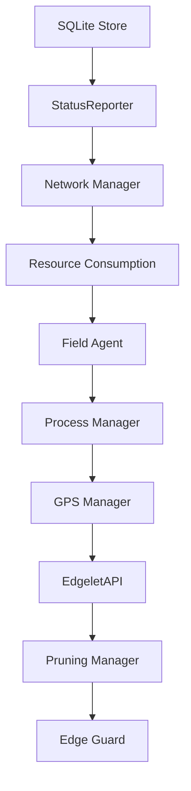

import EditPageAdmonition from '@site/src/components/EditPageAdmonition';

# Modules

Deep-dive documentation for daemon components under `internal/`. For system overview and diagrams, see [Architecture](/learn/edgelet/architecture).

## Module startup order

The **Supervisor** opens SQLite, then starts modules in dependency order. Embedded containerd (when `containerEngine=edgelet`) must be running before Supervisor starts; bootstrap owns that in `cmd/edgelet`.

Approximate sequence in `internal/supervisor/supervisor.go`:

1. Open `store` (`/var/lib/edgelet/edgelet.db`)
2. `statusreporter`. Aggregates module and daemon status for Controller POST
3. `network`. Host interface management
4. `resourceconsumption`. Host resource sampling
5. `fieldagent`. Controller REST client and sync workers
6. `processmanager`. Container reconcile (after engine wired)
7. `gps`. NMEA/device integration
8. `edgeletapi`. HTTPS + Unix `/v1/...`
9. `pruning`. Scheduled/threshold image + unused-local-model prune (not persistent VOLUME data)
10. `edgeguard`. Hardware attestation loop

Host hardware/USB inventory posting (formerly Resource Manager) is **removed**. Edge Guard stays.

Shutdown reverses the order; `store.Close()` runs last (WAL checkpoint).

Lazy or engine-bound components (not separate Supervisor `Start()` modules):

- `volumemount`. Initialized on first use; driven by Field Agent sync
- `dnsresolver`. Started with edgelet engine
- `healthcheck`. Goroutine when `containerEngine=edgelet`
- `proxy`. Updated from Controller change feed
- `runtimeapi`. Library facade for EdgeletAPI handlers
- `serviceaccount`. Reconciled from Process Manager / Field Agent
- `modelmanager`. Model artifact reconcile (wired from Supervisor / EdgeletAPI)

## StatusReporter module indices

`GET /v1/system/status` exposes `modulesStatus[]` aligned with `internal/utils/constants.go`:

| Index | Module |
|-------|--------|
| 0 | Resource Consumption Manager |
| 1 | Process Manager |
| 2 | Status Reporter |
| 3 | EdgeletAPI |
| 4 | Field Agent |
| 5 | *(unused: former Resource Manager; indexes are not reshuffled)* |
| 6 | GPS Manager |

Edge Guard, Pruning, Volume Mount, and SSH Proxy are not in this fixed array; their health surfaces via logs and dedicated status objects.

## Module documentation

### Tier 1: core runtime {#tier-1--core-runtime}

| Module | Document |
|--------|----------|
| Supervisor | [Supervisor](/learn/edgelet/modules/supervisor) |
| Field Agent | [Field agent](/learn/edgelet/modules/fieldagent) |
| Process Manager | [Process manager](/learn/edgelet/modules/processmanager) |
| EdgeletAPI | [Edgelet API module](/learn/edgelet/modules/edgeletapi) |
| SQLite Store | [Store](/learn/edgelet/modules/store) |

### Tier 2: security and identity {#tier-2--security-and-identity}

| Module | Document |
|--------|----------|
| Auth | [Auth](/learn/edgelet/modules/auth) |
| Service Account | [Service account](/learn/edgelet/modules/serviceaccount) |
| Edge Guard | [EdgeGuard](/learn/edgelet/modules/edgeguard): operator guide: [EdgeGuard](/learn/edgelet/edgeguard) |

### Tier 3: runtime plumbing {#tier-3--runtime-plumbing}

| Module | Document |
|--------|----------|
| Container Engines | [Engines](/learn/edgelet/modules/engines): operator guide: [Container engines](/learn/edgelet/container-engines) |
| DNS Resolver | [DNS resolver](/learn/edgelet/modules/dnsresolver): operator guide: [DNS](/learn/edgelet/dns) |
| Healthcheck Runner | [Health check](/learn/edgelet/modules/healthcheck) |
| Pruning Manager | [Pruning](/learn/edgelet/modules/pruning) |
| Volume Mount Manager | [Volume mount](/learn/edgelet/modules/volumemount) |
| Runtime API Facade | [Runtime API](/learn/edgelet/modules/runtimeapi) |

### Tier 4: supporting {#tier-4--supporting}

| Module | Document |
|--------|----------|
| Status Reporter | [Status reporter](/learn/edgelet/modules/statusreporter) |
| Resource Manager (removed) | [Resource manager](/learn/edgelet/modules/resourcemanager) |
| Resource Consumption | [Resource consumption](/learn/edgelet/modules/resourceconsumption) |
| Network Manager | [Network](/learn/edgelet/modules/network) |
| GPS Manager | [GPS](/learn/edgelet/modules/gps) |
| SSH Proxy Manager | [Proxy](/learn/edgelet/modules/proxy) |
| ControlPlane (runtime) | [Control plane module](/learn/edgelet/modules/controlplane): operator guide: [Local control plane](/learn/edgelet/control-plane) |

## Related operator docs

| Topic | Document |
|-------|----------|
| EdgeletAPI usage | [Edgelet API](/learn/edgelet/api) |
| Controller sync / CP deploy | [Local control plane](/learn/edgelet/control-plane) |
| SQLite backup / wipe | [Persistence](/learn/edgelet/persistence) |
| Workload volumes | [Volumes](/learn/edgelet/volumes) |
| Container engines | [Container engines](/learn/edgelet/container-engines) |
| DNS | [DNS](/learn/edgelet/dns) |
| Workload labels/env | [Workload metadata](/learn/edgelet/workload-metadata) |
| Manifest YAML | [Manifests](/learn/edgelet/manifests) |
| Model artifacts | [Models](/learn/edgelet/models) |
| Knowledge artifacts | [Knowledge](/learn/edgelet/knowledge) |
| Crash / last-error inspect | [Troubleshooting](/learn/edgelet/troubleshooting#microservice-crash--restart-loop) |

<EditPageAdmonition />
