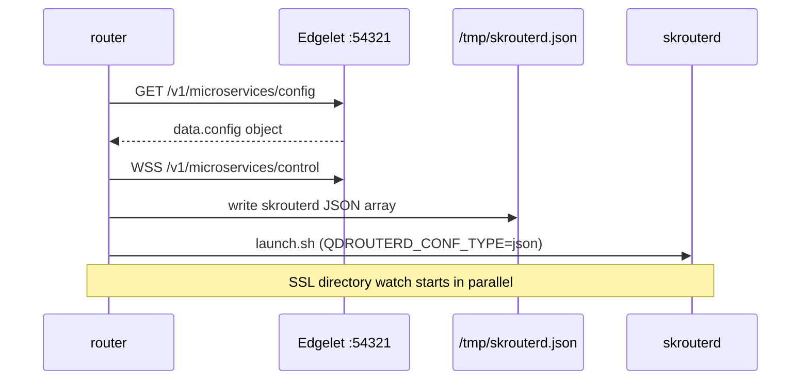
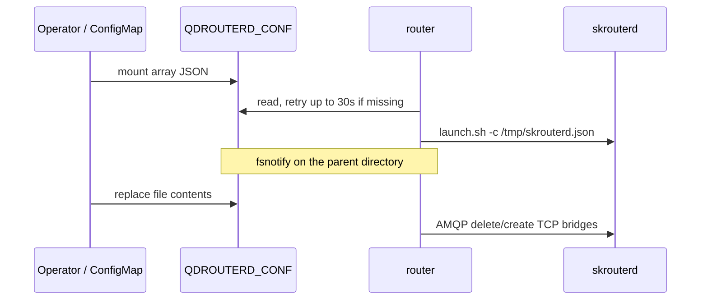

import { REGISTRY } from '@site/src/config/distribution';
import EditPageAdmonition from '@site/src/components/EditPageAdmonition';

# Skupper-router wrapper runtime

How the `router` process supervises embedded `skrouterd`, where configuration comes from on PoT/ioFog and on Kubernetes, and what a later config change actually changes in the running router.

The image on this train is <code>{REGISTRY}/router:3.9.0</code>. It embeds skupper-router **3.5.3**. The Edgelet client it links is `github.com/eclipse-iofog/iofog-go-sdk/v3` **v3.9.0**.

## What runs in the container

The image command is `/home/skrouterd/bin/router`. That Go process does not route AMQP itself. It builds or reads a skupper-router JSON file, then starts `/home/skrouterd/bin/launch.sh`, which execs `skrouterd`. The wrapper stays alive as the parent: it copies the child’s stdout and stderr to its own stdout, and it applies later changes over the router’s AMQP management interface on `amqp://localhost:5672`.

```text
router (pid 1)
  ├── watch Edgelet control socket   (PoT / ioFog only)
  ├── watch QDROUTERD_CONF           (Kubernetes only)
  ├── watch SSL_PROFILE_PATH         (both)
  └── launch.sh → skrouterd -c /tmp/skrouterd.json
```

The container user is uid **10000**. `QDROUTERD_HOME` is `/home/skrouterd`.

`launch.sh` does not read `QDROUTERD_CONF`. It sets `HOSTNAME_IP_ADDRESS` from `hostname -i`, then starts the binary like this:

```bash
EXT=${QDROUTERD_CONF_TYPE:-conf}
CONFIG_FILE=/tmp/skrouterd.${EXT}
# if that file exists: exec skrouterd -c "$CONFIG_FILE"
```

The wrapper always passes `QDROUTERD_CONF_TYPE=json`, so the child looks for **`/tmp/skrouterd.json`**. That matches the default of `QDROUTERD_CONF`. If `QDROUTERD_CONF` is set to any other path, the Go process reads and writes that path, and `launch.sh` still opens `/tmp/skrouterd.json`. Leave the variable at its default unless `launch.sh` is changed to match.

## Choosing a platform

Mode is selected only from the `SKUPPER_PLATFORM` environment variable, in `main`:

| `SKUPPER_PLATFORM` | Mode | Config source |
|--------------------|------|----------------|
| unset | PoT / ioFog | Edgelet LocalAPI |
| `pot` | PoT / ioFog | Edgelet LocalAPI |
| `iofog` | PoT / ioFog (same code path as `pot`) | Edgelet LocalAPI |
| `kubernetes` | Kubernetes | File at `QDROUTERD_CONF` |
| anything else | PoT / ioFog | Edgelet LocalAPI |

`pot` and `iofog` are aliases. There is no separate ioFog binary or code branch.

`--platform` / `-p` and `config.GetPlatform()` are not used for this choice. `GetPlatform()` only fills site metadata inside router records (`platform` in the JSON metadata string). An invalid value there falls back to `kubernetes` for that metadata field; it does not switch the wrapper into Kubernetes mode.

## Environment and paths {#edgelet-localapi-requirements}

| Variable | Default | Used for |
|----------|---------|----------|
| `SKUPPER_PLATFORM` | `pot` (unset is PoT) | Mode selection above |
| `QDROUTERD_CONF` | `/tmp/skrouterd.json` | File the wrapper reads (Kubernetes) or writes (PoT) |
| `QDROUTERD_CONF_TYPE` | set to `json` by the wrapper when it starts the child | Extension in `launch.sh` (`/tmp/skrouterd.json`) |
| `QDROUTERD_HOME` | `/home/skrouterd` | Set in the image |
| `SSL_PROFILE_PATH` | `/etc/skupper-router-certs` | Directory of SSL profile folders |
| `EDGELET_MICROSERVICE_UID` | required in PoT / ioFog | Microservice id for the Edgelet client. Startup fails if it is empty |
| `SSL` | `true` | `true` uses HTTPS and WSS to Edgelet. An empty or unparsable value is treated as `true` |

PoT / ioFog also needs the service-account files Edgelet mounts into the container:

| Path | Contents |
|------|----------|
| `/var/run/secrets/edgelet.iofog.org/serviceaccount/token` | Bearer token |
| `/var/run/secrets/edgelet.iofog.org/serviceaccount/ca.crt` | CA for the Edgelet TLS listener |

The client talks to `edgelet.default.svc.bridge.local:54321`. If that host cannot be dialed (DNS failure, timeout, connection refused), it tries `127.0.0.1:54321`. TLS is 1.2 or newer, with the mounted CA added to the trust pool.

## Two JSON shapes

PoT and Kubernetes do not feed `skrouterd` the same document the control plane stores.

**Edgelet config object** (PoT / ioFog only). `GET /v1/microservices/config` returns an envelope. The client reads `data.config`, which is either a JSON object or a string containing a JSON object, and unmarshals it into the wrapper’s in-memory `router.Config`. Keys are the Go field names (matching is case-insensitive). Nested router entities use the skupper JSON names.

```json
{
  "Metadata": {
    "id": "edge-1",
    "mode": "edge",
    "helloMaxAgeSeconds": "3"
  },
  "SslProfiles": {
    "skupper-internal": {
      "name": "skupper-internal",
      "caCertFile": "/etc/skupper-router-certs/skupper-internal/ca.crt",
      "certFile": "/etc/skupper-router-certs/skupper-internal/tls.crt",
      "privateKeyFile": "/etc/skupper-router-certs/skupper-internal/tls.key"
    }
  },
  "Listeners": {
    "amqp": {
      "name": "amqp",
      "host": "0.0.0.0",
      "port": 5672,
      "role": "normal"
    }
  },
  "Connectors": {},
  "Addresses": {},
  "LogConfig": {
    "DEFAULT": { "module": "DEFAULT", "enable": "info+" }
  },
  "SiteConfig": {
    "name": "site-a",
    "platform": "pot"
  },
  "Bridges": {
    "TCPListeners": {
      "ingress:8080": {
        "name": "ingress:8080",
        "port": "8080",
        "address": "orders:8080",
        "siteID": "site-a"
      }
    },
    "TCPConnectors": {}
  }
}
```

Map keys are the entity name (`Listeners`, `Connectors`, `SslProfiles`, `LogConfig`) or the address prefix (`Addresses`). `Bridges.TCPListeners` and `Bridges.TCPConnectors` are maps of `TCPEndpoint`.

**skrouterd file** (what `skrouterd -c` loads, and what Kubernetes mounts). A JSON array of `[type, body]` pairs. The router entity is written first. Other entities follow in map iteration order, which is not stable across writes.

```json
[
  ["router", { "id": "edge-1", "mode": "edge", "helloMaxAgeSeconds": "3" }],
  ["sslProfile", { "name": "skupper-internal", "caCertFile": "/etc/skupper-router-certs/skupper-internal/ca.crt", "certFile": "/etc/skupper-router-certs/skupper-internal/tls.crt", "privateKeyFile": "/etc/skupper-router-certs/skupper-internal/tls.key" }],
  ["listener", { "name": "amqp", "host": "0.0.0.0", "port": 5672, "role": "normal" }],
  ["log", { "module": "DEFAULT", "enable": "info+" }],
  ["site", { "name": "site-a", "platform": "pot" }],
  ["tcpListener", { "name": "ingress:8080", "port": "8080", "address": "orders:8080", "siteID": "site-a" }]
]
```

Entity type strings the wrapper emits and parses:

| Type string | In-memory field |
|-------------|-----------------|
| `router` | `Metadata` |
| `sslProfile` | `SslProfiles` |
| `listener` | `Listeners` |
| `connector` | `Connectors` |
| `tcpListener` | `Bridges.TCPListeners` |
| `tcpConnector` | `Bridges.TCPConnectors` |
| `address` | `Addresses` (keyed by `prefix`) |
| `log` | `LogConfig` (keyed by `module`) |
| `site` | `SiteConfig` |

Unknown type strings are skipped on read. A top-level object, or a pair that is not a 2-element array, is a hard parse error.

On PoT / ioFog the wrapper is the translator: Edgelet object in, skrouterd array file out. On Kubernetes the operator must mount the array file. The wrapper never calls the Kubernetes API and never rewrites that file.

## PoT / ioFog startup



1. `NewDefaultEdgeletAPIClient()` reads `EDGELET_MICROSERVICE_UID`. Missing uid exits the process before `skrouterd` starts.
2. `GetConfigIntoStruct` loads the Edgelet object into `router.Config`. This is attempted **5 times**, with a pause of 1s, 2s, 3s, then 4s. The first failure is fatal:
   - missing or empty token / unreadable CA → exit, auth material error
   - Edgelet HTTP error envelope → exit
   - any other error after 5 attempts → exit
3. `EstablishControlWsConnection(0)` starts a background dial to `wss://<host>:54321/v1/microservices/control` (or `ws://` when `SSL=false`). The call returns immediately. The socket reconnects forever. Backoff starts at 1s and doubles up to 30s. A buffer of 5 signal bytes is used when the caller passes 0.
4. `StartRouter` creates the directory of `QDROUTERD_CONF` (`0755`) and writes the array file (`0644`) from the in-memory config. It then runs `launch.sh` with `QDROUTERD_CONF` and `QDROUTERD_CONF_TYPE=json` appended to the environment.
5. `SSLProfileDir` starts watching `SSL_PROFILE_PATH` (see below).
6. The main goroutine waits on either child exit or a control signal.

The running `skrouterd` reads the file once, at process start. It does not watch that file. Later PoT updates do not restart it.

### Control-plane updates

Edgelet sends a binary websocket message whose first byte is `0x0C`. The SDK pushes that byte to the wrapper and writes `0x0B` back as an ack. Any other first byte is ignored. If the socket drops, the SDK dials again; the wrapper does not.

On each signal the wrapper:

1. Allocates a fresh empty config (empty maps, empty bridge maps).
2. Fills it from `GET /v1/microservices/config` with the same 5-attempt retry.
3. Calls `UpdateRouter` with that object.

A fetch or update error is logged. The process keeps running and waits for the next signal. There is no timer that retries a failed update by itself. A signal that arrives before `skrouterd` is accepting AMQP on port 5672 fails the management connection and is not applied until a later signal.

### What `UpdateRouter` changes while skrouterd is up

`UpdateRouter` opens `amqp://localhost:5672` with no TLS, queries the local router, and applies **only TCP bridge differences**:

1. `QUERY` `io.skupper.router.tcpConnector` and `io.skupper.router.tcpListener`.
2. Diff that live set against `newConfig.Bridges`.
3. `DELETE` removed connectors, then removed listeners.
4. `CREATE` added connectors, then added listeners.
5. On PoT, write `QDROUTERD_CONF` from the **current** in-memory config, then replace that memory with `newConfig`.

An endpoint is “the same” when name matches and host, port, address, `siteID`, `processId`, and `verifyHostname` match. Empty host and `0.0.0.0` / `::` are treated as the same host. A missing `verifyHostname` matches an explicit `true`. A changed endpoint is deleted and created again.

These fields are **not** part of that comparison, so a bridge update that changes only one of them is not sent to the router:

- `sslProfile` on a TCP listener or connector

These parts of the Edgelet object are stored in memory and are **not** pushed over AMQP by `UpdateRouter`:

- `router` metadata (`id`, `mode`, listeners, connectors, addresses, log, site)
- AMQP `listener` and `connector` entities
- creating or deleting `sslProfile` entities

`UpdateListenerConfig` and `UpdateConnectorConfig` exist in `internal/qdr` and are not called on this path.

The file write inside `UpdateRouter` serializes `router.Config` **before** it is replaced with the config just fetched. The AMQP bridge change uses the new object. The bytes written to disk are the previous snapshot. The new snapshot is written on a later `UpdateRouter`, or when an SSL directory event rewrites the file from current memory. Because `skrouterd` does not re-read the file, the live TCP change is the AMQP create/delete, not that write. The next container start fetches Edgelet again and writes a new file before `launch.sh` runs; `/tmp` does not survive a new container.

Changing listeners, connectors, router id, mode, addresses, or log level in the Edgelet object therefore shows up in memory, and eventually in the file one update later, and takes effect for `skrouterd` on the **next process start**.

## Kubernetes startup

The wrapper does not talk to the Kubernetes API or to Edgelet. The operator mounts the skrouterd **array** document at `QDROUTERD_CONF` (default `/tmp/skrouterd.json`). CI smoke does this with a read-only bind mount of `test/smoke-skrouterd.json` onto `/tmp/skrouterd.json` and `SKUPPER_PLATFORM=kubernetes`.



1. Read `QDROUTERD_CONF`. If the error is “file does not exist”, retry once a second, up to 30 attempts. Any other read error, or still missing after that, exits the process.
2. Unmarshal the array document into memory. A parse error exits the process. `skrouterd` is not started.
3. `StartRouter` does **not** create or overwrite the file. It only execs `launch.sh`.
4. `ConfigFile` watches the parent directory of `QDROUTERD_CONF` (it creates that directory if needed).
5. `SSLProfileDir` watches the cert directory.
6. The main goroutine blocks until `launch.sh` / `skrouterd` exits.

### File watch

The watcher reacts to `Create` and `Write` on the config path only. Other files in the directory are ignored. Events are debounced **500ms**; a burst of writes produces one read. An empty file is ignored. A missing file on the debounced read is ignored.

The callback compares the new bytes with the last successfully applied text. Identical content returns without calling the router. Different content is unmarshaled as the array document and passed to `UpdateRouter`. On success, that text becomes the last-applied snapshot. On failure, the snapshot stays at the previous good text, so a later write of the same new content is tried again. A failed update is not retried until another create/write event.

`UpdateRouter` on Kubernetes uses the same AMQP TCP-bridge diff as PoT, and it **does not write** `QDROUTERD_CONF`. The mounted file stays under the operator’s control.

Same hot-reload limit as PoT: a ConfigMap edit that changes listeners, connectors, router metadata, addresses, log, or site is parsed and kept in memory, and it is not applied to the running `skrouterd`. Restart the container to load those fields from the file. TCP listener and TCP connector add/remove/replace are applied live, once management on port 5672 accepts a connection.

## SSL profiles (both modes)

`SSL_PROFILE_PATH` is a directory of profile folders. A folder counts only when it contains `ca.crt`. `tls.crt` and `tls.key` are optional. The profile name is the directory name. Paths stored on the profile are absolute.

```text
/etc/skupper-router-certs/
  skupper-internal/
    ca.crt
    tls.crt
    tls.key
  orders-tls/
    ca.crt
```

Example profile produced by a scan:

```json
{
  "name": "skupper-internal",
  "caCertFile": "/etc/skupper-router-certs/skupper-internal/ca.crt",
  "certFile": "/etc/skupper-router-certs/skupper-internal/tls.crt",
  "privateKeyFile": "/etc/skupper-router-certs/skupper-internal/tls.key"
}
```

The watcher registers the base directory and each immediate subdirectory. A new subdirectory created later is watched too. Nested directories deeper than one level are not. Create, write, and remove are debounced **500ms**, then the tree is scanned again.

If the scan returns at least one profile, each profile is copied into `Config.SslProfiles` by name. Profiles that disappeared from disk are left in memory. The callback does nothing when the scan is empty, including when the directory has no `ca.crt` yet.

Then:

- **PoT / ioFog:** rewrite `QDROUTERD_CONF` from current memory (this write includes SSL paths merged into the current config).
- **Kubernetes:** do not touch the mounted config file.
- **Both:** connect to `amqp://localhost:5672` and `UPDATE` `io.skupper.router.sslProfile` for each scanned name, using the attributes already loaded in the router.

`ReloadSslProfile` looks up the profile by name and updates that existing entity so `skrouterd` re-reads the cert files. It does not create a profile that was not in the config `skrouterd` loaded at start. A new profile directory is merged into memory (and, on PoT, into the file) and the AMQP update logs an error until the process is restarted with that profile in the initial JSON.

If the base directory does not exist when the watcher starts, the watcher logs nothing and returns. It does not wait for the directory to appear.

## AMQP management

Hot reload always uses a new connection to `amqp://localhost:5672`, a session, a dynamic reply address, and a sender to `$management`. Requests time out after 5 seconds. The local router is identified with `QUERY io.skupper.router.router` during connect; that lookup must return exactly one record.

Bridge operations:

| Change | Management operation | Entity type |
|--------|----------------------|-------------|
| TCP connector removed or replaced | `DELETE` | `io.skupper.router.tcpConnector` |
| TCP listener removed or replaced | `DELETE` | `io.skupper.router.tcpListener` |
| TCP connector added or replaced | `CREATE` | `io.skupper.router.tcpConnector` |
| TCP listener added or replaced | `CREATE` | `io.skupper.router.tcpListener` |
| Cert files rotated for an existing profile | `UPDATE` | `io.skupper.router.sslProfile` |

Deletes run before creates. The first management error aborts the rest of that update. The in-memory config is replaced only after the bridge update and the PoT file write both succeed. A failed Kubernetes update leaves both memory and the last-applied file text unchanged.

## Operating a config change

### PoT / ioFog

1. Run the image with `SKUPPER_PLATFORM` unset, `pot`, or `iofog`.
2. Set `EDGELET_MICROSERVICE_UID` to this microservice’s uid.
3. Mount the service-account token and CA. Leave `SSL=true` unless Edgelet is plain HTTP on port 54321.
4. Put the initial router definition in the microservice config as the **object** shape (not the skrouterd array). Include every listener, connector, address, and SSL profile the process should start with. Point `caCertFile` / `certFile` / `privateKeyFile` at files under `SSL_PROFILE_PATH`, or let a later cert watch fill those paths for profiles that already exist.
5. Start the container. The wrapper will not exec `skrouterd` until the first `GET /v1/microservices/config` succeeds.
6. To change TCP listeners or connectors: update that microservice config in the control plane so Edgelet emits a control signal (`0x0C`). The wrapper refetches and applies the bridge diff. Confirm with router logs (`CREATE` / `DELETE` lines) or by querying management. No container restart is required for those entities.
7. To rotate a certificate for a profile `skrouterd` already has: replace `ca.crt`, `tls.crt`, or `tls.key` in that profile directory. Within about 500ms the wrapper sends `UPDATE` on that `sslProfile`.
8. To change router id, mode, AMQP listeners, AMQP connectors, addresses, log modules, or site, or to add an SSL profile that was not in the file at process start: update the Edgelet config, then restart the container so `StartRouter` writes a new file and `launch.sh` starts a new `skrouterd`.

### Kubernetes

1. Set `SKUPPER_PLATFORM=kubernetes`. `EDGELET_MICROSERVICE_UID` is not used.
2. Mount the skrouterd **array** file at `/tmp/skrouterd.json`, or at `QDROUTERD_CONF` **and** keep that path equal to `/tmp/skrouterd.json`. `launch.sh` will not open a different path.
3. The file must exist within about 30 seconds of process start, and it must parse as the array document.
4. To change TCP listeners or connectors: update the mounted file (ConfigMap roll, or an atomic replace that produces a write event). After 500ms of quiet, the wrapper diffs bridges and applies them. A rewrite with identical bytes is a no-op.
5. To rotate certs: same as PoT, under `SSL_PROFILE_PATH`. The wrapper will not rewrite the ConfigMap.
6. To change any non-bridge entity: update the file and restart the pod. The running router keeps the listeners and connectors it loaded at start.

## Process exit

`launch.sh` replaces itself with `skrouterd`. When that process exits, the wrapper receives the wait result and returns success from `main`. Setup failures before that (missing Kubernetes file, bad initial JSON, Edgelet client or initial `GetConfig` failure, inability to write the PoT config file) exit non-zero via `log.Fatal`. A later management or watch error does not exit the process.

Stdout and stderr from `launch.sh` / `skrouterd` are copied line by line to the wrapper’s stdout.

## Source map

| Behavior | Code |
|----------|------|
| Mode switch, PoT loop, Kubernetes loop, Edgelet retry | `main.go` |
| `SKUPPER_PLATFORM` | `internal/config/platform.go` |
| `QDROUTERD_CONF`, `SSL_PROFILE_PATH` | `internal/config/env.go` |
| Build array JSON, start `launch.sh`, AMQP bridge update, SSL reload | `internal/router/router.go` |
| Parse and diff router config | `internal/qdr/qdr.go` |
| AMQP management client | `internal/qdr/amqp_mgmt.go`, `internal/qdr/messaging.go` |
| Config file watch | `internal/watch/config.go` |
| SSL directory watch | `internal/watch/ssl.go` |
| Child process | `internal/exec/exec.go`, `scripts/launch.sh` |
| Edgelet HTTP and websocket client | `github.com/eclipse-iofog/iofog-go-sdk/v3/pkg/microservices` |

<EditPageAdmonition />
