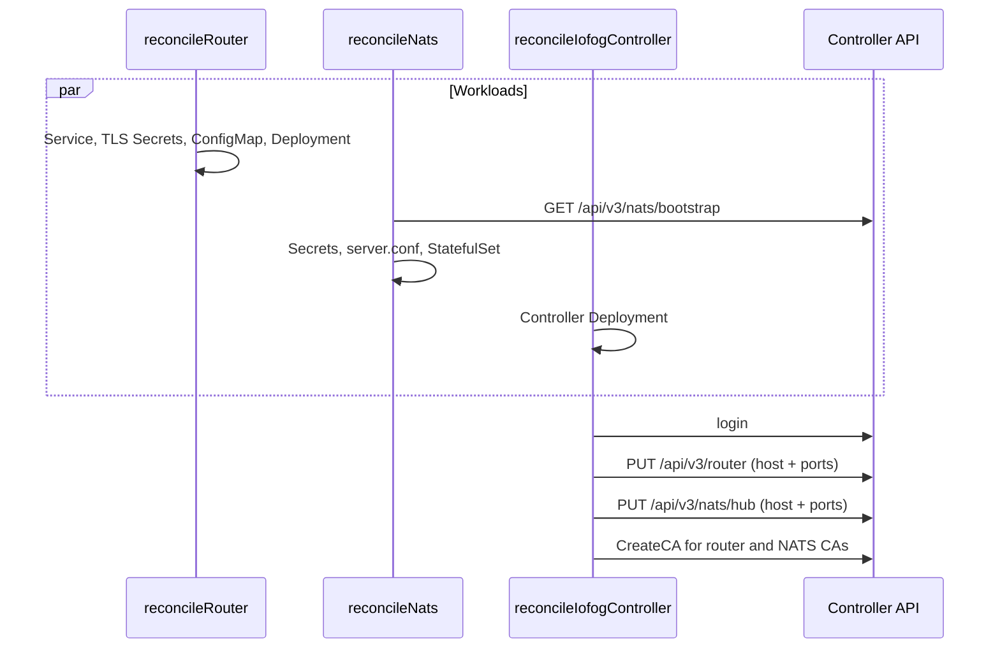

# Networking topology: control plane

Datasance PoT / Eclipse ioFog has two control planes. Both are secure by default. The difference is who creates the default router and the NATS hub, and how those two processes are updated afterward.

| Control plane | Where Controller runs | Who creates `default-router` and the NATS hub |
|---|---|---|
| Kubernetes | Operator Deployment `controller` in the cluster | The operator creates the Router Deployment and the NATS StatefulSet, then registers them with the Controller API |
| Remote | Edgelet, on the system agent (`isSystem`) | Edgelet registers the `controller` system microservice. Controller provisions the `router` and `nats` system microservices on that node |

An Edgelet node you add later is the same in both cases. You declare the agent role. Controller issues certificates, creates the node’s `router` and `nats` system microservices, and attaches them to the hub. That path is in [networking-topology-service-interconnection.md](/reference/controller/networking-topology-service-interconnection) and [networking-topology-messaging-fabric.md](/reference/controller/networking-topology-messaging-fabric). This document is the hub itself.

Creating an agent with `isSystem: true` is rejected when the control plane is Kubernetes. On a remote control plane, the first agent in an empty cluster is promoted to `isSystem`, `routerMode: interior`, and `natsMode: server`.

---

## Kubernetes control plane

The operator creates the Router Deployment and the NATS StatefulSet, produces the certificates and the configuration files, and registers the default router and the NATS hub with the Controller API. Router and NATS pods can exist before registration finishes. Edges use the addresses stored in the Controller after registration succeeds.

While the ControlPlane condition is `deploying` or `updating`, three reconcilers run in parallel:

| Reconciler | Workload | Registers with Controller? |
|---|---|---|
| Router | Deployment `router`, Service `router`, ConfigMap `iofog-router`, TLS Secrets | No |
| NATS | StatefulSet `nats`, Services, ConfigMaps, bootstrap Secrets, TLS Secrets | No. It calls Controller only to read NATS bootstrap |
| Controller | Controller Deployment | Yes. Default router, NATS hub, and CA import |



NATS reconcile exits immediately when `spec.nats.enabled` is `false`. Omitting `spec.nats` means NATS is enabled.

CR fields that feed these workloads are `services.router`, `ingresses.router`, `replicas.nats`, and `nats.jetStream`.

### Router objects

| Kind | Name | Notes |
|---|---|---|
| Deployment | `router` | 1 replica. Command: `/home/skrouterd/bin/router` |
| Service | `router` | Type from `spec.services.router.type` (default LoadBalancer) |
| ConfigMap | `iofog-router` | Key `skrouterd.json` |
| ServiceAccount / Role / RoleBinding | `router` | Watch pods, configmaps, secrets, services; leases |
| Secrets | Router certificates below | |

A second Deployment `router-2` exists in code only when an internal HA flag is true. That flag is not wired to the CR (`spec.router` is unused). A standard ControlPlane creates one router.

Pod labels include `application: interior-router`, `skupper.io/component: router`, `skupper.io/type: site`, plus operator standard labels. Prometheus annotations scrape port 9090.

| Service port name | Port | Container | Role |
|---|---|---|---|
| `router-message` | 5671 | `amqps` | Messaging (AMQPS) |
| `router-interior` | 55671 | `inter-router` | Inter-router |
| `router-edge` | 45671 | `edge` | Edge listeners |

HTTP health and metrics listen on container port 9090 (`/healthz`). That port is not on Service `router`.

The router reconcile creates the Service first, then needs an external hostname or IP for certificate SANs:

| Condition | Address used |
|---|---|
| `services.router.type` is `LoadBalancer` | LoadBalancer hostname or IP on Service `router` (reconcile waits) |
| Otherwise | `spec.ingresses.router.address` |

If the Service is not a LoadBalancer and `ingresses.router.address` is empty, reconcile fails with `missing Proxy.Router data for non LoadBalancer Router service`.

### Router certificates

The operator looks up these Secrets in the ControlPlane namespace. If any is missing, it generates the missing ones (RSA 2048, 5 years, type `kubernetes.io/tls`). If all four already exist, it reuses them and does not regenerate.

| Secret | Role | Signed by |
|---|---|---|
| `router-site-ca` | Site CA (self-signed when the operator creates it) | itself |
| `default-router-local-ca` | Local CA (self-signed when the operator creates it) | itself |
| `router-site-server` | Site server cert | `router-site-ca` |
| `router-local-server` | Local server cert | `default-router-local-ca` |

| Secret | Common name | DNS / IP names |
|---|---|---|
| `router-site-server` | `iofog-router` | `router.<namespace>.svc.cluster.local` and the external address |
| `router-local-server` | `iofog-router-local` | same |

Each Secret has `tls.crt`, `tls.key`, and `ca.crt`. For a CA Secret, `ca.crt` is the same as `tls.crt`. For a server Secret, `ca.crt` is the signing CA.

Bring your own CA by creating `router-site-ca` and/or `default-router-local-ca` (and optionally the server Secrets) before reconcile. The operator signs missing server certs with the CA that is already in the cluster. Existing Secrets are not overwritten on later reconciles.

The Deployment mounts only the server Secrets:

| Volume | Mount path |
|---|---|
| Secret `router-site-server` | `/etc/skupper-router-certs/router-site-server` |
| Secret `router-local-server` | `/etc/skupper-router-certs/router-local-server` |
| ConfigMap `iofog-router` | `/tmp/skrouterd.json` (key `skrouterd.json`) |

These hub certificate names have no agent suffix. Certificates Controller later issues for an Edgelet agent are `router-site-server-{agentName}` and `router-local-server-{agentName}`, signed by the same CAs after those CAs are imported.

### Router configuration

The operator stores `skrouterd.json` in ConfigMap `iofog-router`. The document is a JSON array of pairs. The container reads it via:

| Env | Value |
|---|---|
| `QDROUTERD_CONF` | `/tmp/skrouterd.json` |
| `QDROUTERD_CONF_TYPE` | `json` |
| `SSL_PROFILE_PATH` | `/etc/skupper-router-certs` |
| `SKUPPER_SITE_ID` | `default-router` |
| `SKUPPER_PLATFORM` | `kubernetes` |
| `QDROUTERD_AUTO_MESH_DISCOVERY` | `QUERY` |
| `APPLICATION_NAME` | `router` |
| `POD_NAMESPACE` / `POD_IP` | downward API |

Placeholders in the template are filled with fixed ports and the ControlPlane namespace (site `namespace` field). They are not taken from `ingresses.router.*` ports. Those ingress ports are used only when registering the router with the Controller.

| Config entity | Name | What it does |
|---|---|---|
| `router` | id `default-router`, mode `interior` | Interior router identity. Metadata includes `"iofog-config": "1.0.0"` |
| `site` | `default-router` | Platform `kubernetes`, namespace = ControlPlane namespace |
| `sslProfile` | `system-default` | System CA bundle `/etc/pki/tls/certs/ca-bundle.crt` |
| `sslProfile` | `router-site-server` | `tls.crt` / `tls.key` / `ca.crt` under `/etc/skupper-router-certs/router-site-server` |
| `sslProfile` | `router-local-server` | same layout under `router-local-server` |
| `listener` | `iofog-router-edge` | role `edge`, port 45671, sslProfile `router-site-server`, SASL `EXTERNAL`, `authenticatePeer: true` |
| `listener` | `amqp` | host `localhost`, port 5672, no TLS (in-pod only; not on the Service) |
| `listener` | `amqps` | port 5671, sslProfile `router-local-server`, SASL `EXTERNAL` |
| `listener` | `@9090` | HTTP health and metrics on 9090 |
| `listener` | `iofog-router-inter-router` | role `inter-router`, port 55671, sslProfile `router-site-server` |
| `address` | prefix `mc` | multicast distribution |
| `log` | `ROUTER_CORE` | `error+` |

If `iofog-router` already exists, the operator merges. Entries of type `router`, `site`, `address`, and `log` are replaced from the new template. `sslProfile` and `listener` entries are replaced only when their names match the table above. Other existing entries are kept. If metadata `iofog-config` versions match, the existing document is left unchanged. That merge is what keeps the `tcpListener` and `tcpConnector` entries Controller adds for Services.

### Registering the default router

This runs in the operator’s controller reconcile, after login. The operator calls `PUT /api/v3/router`. Controller stores one default-router record (`isDefault: true`, interior). It does not create a router microservice for that record. The host and ports are what later agents dial.

| API field | Source |
|---|---|
| `host` | LoadBalancer address of Service `router`, or `spec.ingresses.router.address` |
| messaging port | LoadBalancer path: 5671. Ingress path: `ingresses.router.messagePort` (0 means the API receives 0; set the port explicitly when using ingress) |
| inter-router port | LoadBalancer: 55671. Ingress: `ingresses.router.interiorPort` |
| edge port | LoadBalancer: 45671. Ingress: `ingresses.router.edgePort` |

A missing port is stored as the default (5671, 55671, 45671). `host` is required. Edges and tools then learn the router endpoint from the Controller, not by reading the Kubernetes Service directly.

### NATS objects

| Kind | Name | Notes |
|---|---|---|
| StatefulSet | `nats` | `serviceName: nats-headless`. Replicas = `spec.replicas.nats`, minimum 2 |
| Service | `nats-headless` | `ClusterIP: None`. All NATS ports. Pod DNS `nats-0.nats-headless`, `nats-1.nats-headless`, … |
| Service | `nats` | Type from `spec.services.nats` (LoadBalancer if type is empty). Ports: cluster, leaf, mqtt |
| Service | `nats-server` | Type from `spec.services.natsServer`. Ports: client and monitor only |
| ConfigMap | `iofog-nats-config` | Key `server.conf` |
| ConfigMap | `iofog-nats-jwt-bundle` | Account JWT files |
| PVC template | `js-data` | JetStream file store. Default size 10Gi |
| ServiceAccount / Role / RoleBinding | `nats` | get/list/watch configmaps and secrets |

Run-as user/group/fsGroup is 10000.

| Name | Port | Where it is exposed |
|---|---|---|
| client | 4222 | Headless and `nats-server`. Not on Service `nats` |
| cluster | 6222 | Headless and Service `nats` |
| leaf | 7422 | Headless and Service `nats` |
| mqtt | 8883 | Headless and Service `nats` |
| monitor | 8222 | Headless and `nats-server`. HTTP `/healthz?js-enabled-only=true` |

These ports are compiled into the NATS container env and into `server.conf`. `spec.ingresses.nats.*Port` does not change the in-cluster listeners. Those fields are used when registering the hub. The leaf advertise host:port uses the ingress leaf port when it is greater than 0.

### Bootstrap

NATS reconcile talks to the Controller inside the cluster:

`http(s)://controller.<namespace>.svc.cluster.local:51121`

Scheme is `https` only when `spec.controller.https` is true. It logs in, then calls `GET /api/v3/nats/bootstrap`. Controller creates the operator JWT, the system account, and the hub system user `admin-hub`. The operator only stores the response:

| Secret | Contents |
|---|---|
| `nats-operator-seed` | key `seed` — operator seed from the API |
| `nats-creds-sys-admin-hub` | key `admin-hub.creds` — base64-decoded creds file |

The operator JWT and system-account public key are written into `server.conf` and the JWT ConfigMap. They are not a separate JWT secret.

JetStream encryption key Secret `nats-jetstream-key-<controlplane-name>`, key `jsk`: 32 random bytes, base64-encoded. Created once; reused if `jsk` is already present. Mounted at `/etc/nats/jetstream` and also injected as env `JETSTREAM_KEY`. `JETSTREAM_PREV_KEY` is empty on first install.

If the Controller is not ready yet, NATS reconcile requeues. That is expected while the three reconcilers run together.

### NATS certificates

Checked independently. A missing Secret is generated; an existing Secret is left as-is.

| Secret | Role | Signed by |
|---|---|---|
| `nats-site-ca` | Site CA | self-signed when generated |
| `default-nats-local-ca` | Local CA | self-signed when generated |
| `nats-site-server` | Cluster and leaf TLS | `nats-site-ca` |
| `nats-mqtt-server` | MQTT TLS | `default-nats-local-ca` |

Common names: `iofog-nats` (site server), `iofog-nats-mqtt` (MQTT).

SANs (same list for both server certs) include:

- `nats-0.nats-headless`, `nats-1.nats-headless`, … for each replica
- `*.nats-headless.<namespace>.svc.cluster.local`
- `nats.<namespace>.svc.cluster.local`
- `nats-server.<namespace>.svc.cluster.local`
- the external address when known (LoadBalancer host of Service `nats`, or `ingresses.nats.address`)

Server Secrets are annotated `datasance.com/nats-replicas`. If `spec.replicas.nats` changes, the operator deletes `nats-site-server` and `nats-mqtt-server` and recreates them so SANs match the new replica count. CA Secrets are not deleted.

| Condition | Address used for SANs |
|---|---|
| `services.nats.type` is `LoadBalancer` | LB address of Service `nats` |
| `ingresses.nats.address` is set | that hostname |
| neither | SANs are in-cluster names only; hub registration is skipped later if the address is still empty |

Bring your own CA with the same secret names. Create the CA Secrets before reconcile. The operator signs a missing server cert with the CA already in the cluster and does not overwrite an existing Secret.

| Volume | Mount |
|---|---|
| Secret `nats-site-server` | `/etc/nats/certs/nats-site-server` |
| Secret `nats-mqtt-server` | `/etc/nats/certs/nats-mqtt-server` |
| ConfigMap `iofog-nats-config` | `/etc/nats/config` |
| ConfigMap `iofog-nats-jwt-bundle` | `/tmp/nats/jwt` |
| Secret `nats-creds-sys-admin-hub` | `/etc/nats/creds/admin-hub.creds` |
| PVC `js-data` | `/home/runner/data` |

Agent NATS certificates use different names: `nats-server-{agent}` and `nats-mqtt-server-{agent}`. They are signed by `nats-site-ca` and `default-nats-local-ca` after those CAs are imported.

### NATS configuration

ConfigMap `iofog-nats-config`, key `server.conf`, is rewritten on every NATS reconcile so replica routes stay current. Container env `NATS_CONF=/etc/nats/config/server.conf`.

`$SELFNAME` is left in the file. Env `SELFNAME` is the pod name (`metadata.name`), and the NATS image substitutes it so each replica has a distinct `server_name`.

| `server.conf` setting | Value the operator writes |
|---|---|
| `port` | 4222 |
| `http_port` | 8222 |
| `operator` | Operator JWT from bootstrap |
| `system_account` | System account public key from bootstrap |
| `jetstream.store_dir` | `/home/runner/data` |
| `jetstream.domain` | ControlPlane namespace |
| `jetstream.max_memory_store` | `spec.nats.jetStream.memoryStoreSize`, default 1G (NATS units; `1Gi` in the CR becomes `1G`) |
| `jetstream.max_file_store` | storage size, default 10G. PVC uses Kubernetes units (default 10Gi) |
| `jetstream.cipher` / `key` | `chachapoly` and the `jsk` secret value |
| `cluster.name` | ControlPlane metadata.name |
| `cluster.port` | 6222 |
| `cluster.no_advertise` | `true` |
| `cluster.routes` | `nats://nats-<i>.nats-headless:6222` for each replica, plus any non-ordinal routes already in the ConfigMap (routes Controller added for agents). Operator ordinals are replaced, not duplicated |
| `cluster.tls` | files under `/etc/nats/certs/nats-site-server`, `verify: true`, `handshake_first: true` |
| `leafnodes.port` | 7422 |
| `leafnodes.advertise` | `<external-address>:<leafPort>` when an external address exists. `leafPort` is `ingresses.nats.leafPort` if greater than 0, otherwise 7422. Omitted when there is no external address |
| `leafnodes.tls` | same site server cert as cluster |
| `mqtt.port` | 8883 |
| `mqtt.tls` | `/etc/nats/certs/nats-mqtt-server` |
| `resolver` | `type: full`, `dir: /home/runner/nats/jwt`, interval `2m` |

JWT bundle ConfigMap `iofog-nats-jwt-bundle` starts as one key `<systemAccountPublicKey>.jwt`. The operator creates it if missing and does not replace an existing ConfigMap. Controller fills the rest of the keys afterward.

| Env | Value |
|---|---|
| `NATS_SERVER_MODE` | `server` |
| `NATS_JWT_DIR` | `/home/runner/nats/jwt` |
| `NATS_JWT_MOUNT_DIR` | `/tmp/nats/jwt` |
| `NATS_TLS_DIR` | `/etc/nats/certs` |
| `NATS_CERT_NAME` | `nats-site-server` |
| `NATS_MQTT_CERT_NAME` | `nats-mqtt-server` |
| `NATS_SYS_USER_CRED_PATH` | `/etc/nats/creds/admin-hub.creds` |
| `JETSTREAM_KEY` | from Secret key `jsk` |

If the live StatefulSet has more replicas than desired, the operator sets pod annotation `kubectl.kubernetes.io/restartedAt` so NATS restarts and drops removed cluster routes. Scale-up does not add that annotation.

### Registering the NATS hub

This runs in the operator’s controller reconcile when NATS is enabled, after the default router is registered. The operator calls `PUT /api/v3/nats/hub`. Controller stores one hub record (`isHub: true`, `isLeaf: false`) with no agent uuid. No agent is marked hub.

| Condition | Host |
|---|---|
| `services.nats.type` is `LoadBalancer` | LB address of Service `nats` (waits until assigned) |
| otherwise | `spec.ingresses.nats.address` |

If the host is still empty, the hub is not registered.

Ports sent to the API (0 in the CR is replaced by the default):

| Field | Default |
|---|---|
| server | 4222 |
| cluster | 6222 |
| leaf | 7422 |
| mqtt | 8883 |
| http (monitor) | 8222 |

When using ingress, set `ingresses.nats` to the hostname and ports that external clients use. Those values are what the Controller stores for agents. They do not retarget the Kubernetes Service ports.

### Importing CAs

After hub registration, the operator imports CA Secrets so Controller can sign agent certificates with the same authorities. Each call is create-CA with `type: k8s-secret` and `secretName` equal to the Secret name, only if that CA is not already present. Controller reads the Secret in the ControlPlane namespace and stores `ca.crt` and the key under the same name.

| Secret imported | When |
|---|---|
| `router-site-ca` | always |
| `default-router-local-ca` | always |
| `nats-site-ca` | NATS enabled |
| `default-nats-local-ca` | NATS enabled |

Agent reconcile then finds the CA already present and issues the per-node server certificates. It does not generate a second CA.

```text
Router pod
  skrouterd.json  -> listeners 5671 / 45671 / 55671 + sslProfiles
  Secrets         -> router-site-server, router-local-server
  Service router  -> same three ports to the outside
        |
        +--> PUT /api/v3/router (host, ports)
        +--> CreateCA(router-site-ca, default-router-local-ca)

NATS pod nats-0 / nats-1
  server.conf     -> ports, JWT, JetStream, cluster routes, TLS paths
  Secrets         -> nats-site-server, nats-mqtt-server, creds, jetstream key
  Service nats    -> 6222 / 7422 / 8883
  Service nats-server -> 4222 / 8222
        |
        +--> GET /api/v3/nats/bootstrap (operator stores JWT and creds)
        +--> PUT /api/v3/nats/hub (host, ports)
        +--> CreateCA(nats-site-ca, default-nats-local-ca)
```

### What Controller writes back

The operator owns the hub processes and the listener, TLS, and replica-route sections. Controller patches three ConfigMaps after that, and only those parts.

**`iofog-router` / `skrouterd.json`.** The hub side of a Service is applied here: every hub `tcpListener`, and a `tcpConnector` whose site is `default-router`. Controller reads the array, upserts or deletes those entries by name, and writes the array back. Operator entries (`router`, `site`, `listener`, `sslProfile`) stay in the document. The operator’s next merge keeps entries whose names are not in its template, so a later operator reconcile does not drop the service bridges. A connector or listener that belongs on an Edgelet agent is written to that agent’s router microservice, not to this ConfigMap. How a Service becomes those entries is in [service-interconnection.md](/reference/controller/service-interconnection).

**`iofog-nats-config` / `server.conf`.** When an agent NATS server is ensured or removed, Controller rewrites the `routes` array. Every route that contains `nats-headless` is kept. Routes for agent servers (`nats://{agentHost}:{clusterPort}`) are appended. The operator’s next rewrite replaces its own `nats-<i>.nats-headless` ordinals and keeps those non-ordinal routes. Removing an agent server also rolls the `nats` StatefulSet so the pods drop the deleted route. Adding a server patches the ConfigMap and does not roll the StatefulSet by itself.

**`iofog-nats-jwt-bundle`.** When application accounts change, Controller patches this ConfigMap with the full resolver bundle: the system account, every application with `natsAccess`, and the controller relay account when NATS relay is enabled. The patch runs only when the bundle contents change. Because the operator does not replace an existing ConfigMap, those extra account JWTs survive the operator’s next reconcile. User credential files are not in this bundle. How those accounts are signed is in [nats-access.md](/reference/controller/nats-access).

No agent on this control plane is `isSystem`, and none of them is the hub. A leaf still dials the hub host stored by `PUT /api/v3/nats/hub`. An edge router still dials the host stored by `PUT /api/v3/router`.

---

## Remote control plane

There is no operator and no Kubernetes ConfigMap named `iofog-router` or `iofog-nats-config`. Controller runs as a process on an Edgelet node. That node is the system agent.

Edgelet registers Controller on that node with `POST /api/v3/agent/controller/register`. The call is accepted only when the agent is `isSystem`. Controller stores a system microservice named `controller` in the application `system-{agentName}`, with the images, ports, and volume mappings Edgelet sent. Later register calls with the same microservice uuid update that record and flag the agent.

On an empty remote cluster, creating the first agent promotes it to `isSystem`, `routerMode: interior`, and `natsMode: server`, including when the request asked for another role. Controller then provisions the `router` and `nats` system microservices on that same node. The router is marked default when no default router exists yet. The NATS server is marked hub when no hub exists yet. That is `default-router` and the NATS hub. Later agents attach to them.

Certificates, listeners, leaf remotes, and JetStream for that node are the same provisioning path as any other agent, described in the two topology documents. The names are per agent (`router-site-server-{agentName}`, `nats-server-{agent}`), not the unsuffixed hub names the operator uses on Kubernetes. Controller creates `router-site-ca`, `default-router-local-ca`, `nats-site-ca`, and `default-nats-local-ca` itself, self-signed, valid for 60 months, the first time that node is reconciled.

### How updates are applied

| Change | Where it is written | How the node picks it up |
|---|---|---|
| Router listeners, connectors, TLS profiles | `config` on the `router` system microservice. Object form, with `bridges.tcpListeners` and `bridges.tcpConnectors` | Edgelet change list, microservice config |
| Service bridge on the default router | Same microservice config object | Same change list |
| NATS `server.conf` or `leaf.conf` | Controller ConfigMap `nats-server-conf-{agent}`, key `server.conf`, mounted at `/etc/nats/config` | Volume mount on the `nats` system microservice |
| Account JWT bundle on the hub | Controller ConfigMap `iofog-nats-jwt-bundle`, mounted at `/tmp/nats/jwt` | Same volume-mount path. There is no operator rewrite to preserve |
| Cluster membership | Every server’s `server.conf` is rendered again. Growing from one server to many rebuilds the local NATS container so it leaves the no-cluster template | Change list, and `rebuild` when the template changes |
| Host or role change | Certificates reissued, secrets remounted | Change list, `volumeMounts` |

A system agent must stay `routerMode: interior` and `natsMode: server`. An interior router that still has downstream routers cannot be switched to `edge`. The router container on this node uses host networking so 45671 and 55671 bind on the host. The NATS container does not.

```text
Edgelet on the system node
  registers microservice "controller"
        |
        +--> Controller provisions microservice "router"
        |      skrouterd.json in the microservice config
        |      certs router-site-server-{name}, router-local-server-{name}
        |      this router row is default-router
        |
        +--> Controller provisions microservice "nats"
               server.conf in nats-server-conf-{name}
               this NATS row is the hub
               leaves and extra servers dial its host
```

