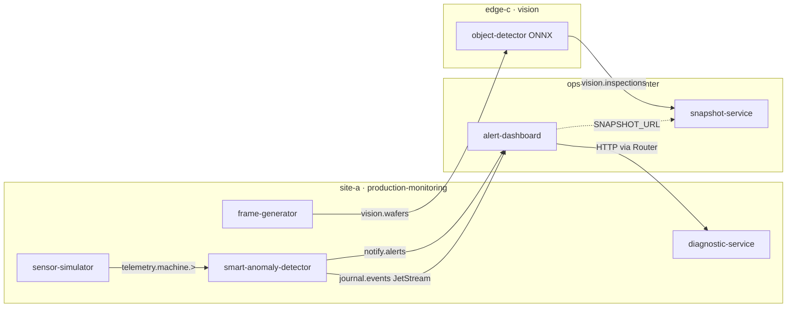

import CliBlock from '@site/src/components/CliBlock';

import FlavorYaml from '@site/src/components/FlavorYaml';
import { CLI_NAME, PRODUCT_NAME } from '@site/src/config/distribution';

# Acme Smart Plant Tutorial

:::warning[Greenfield release: v3.8.0]

Platform train **v3.8.0** is a greenfield release. Complete the [Migrating to v3.8.0](/migrating-to-v3-8) checklist before running this tutorial.

:::

This tutorial deploys the **Acme Smart Plant** reference demo on a live ECN. You use {CLI_NAME} YAML from the [pot-edge-patterns](https://github.com/Datasance/pot-edge-patterns) repo. No hand-built NATS credentials and no Kubernetes manifests.

The story has two phases:

1. **Phase 1, Smart factory**: four CNC/press machines on **site-a**, remote operations dashboard on **ops-b**
2. **Phase 2, Fab vision inspection**: wafer frames on **site-a**, ONNX inference on **edge-c**, inspection gallery on **ops-b**

## Scenario

Acme runs a production floor with four machines (`M001`–`M004`). A **sensor-simulator** replays curated manufacturing rows. A **smart-anomaly-detector** watches telemetry and raises alerts. Operators on **ops-b** see fleet charts, live alerts, and an event journal without exposing raw factory telemetry outside the plant NATS account.

When a fault fires, the dashboard calls **diagnostic-service** on **site-a** through a **Router** bridge. Phase 2 adds wafer inspection: **frame-generator** publishes thumbnails, **object-detector** runs wafer-defect ONNX on **edge-c**, and **snapshot-service** serves a gallery on **ops-b**.

Default Edgelet node names are **site-a**, **ops-b**, and **edge-c**. Override `agent.name` in Application YAML if your ECN uses different names.

## Topology

Three Edgelet nodes, two NATS integration styles, and Router HTTP bridges:

**PoT primitives in one plant story:**

| Primitive | Where you see it |
| --------- | ---------------- |
| In-account NATS pub/sub | Telemetry inside **production-monitoring** |
| Cross-account NATS export/import | Alerts and fleet telemetry from plant to **operations-center** |
| Router Service interconnect | Dashboard on **ops-b** calls HTTP on **site-a** |
| Edge AI placement | ONNX inference on **edge-c** for fab inspection |

## NATS subjects and cross-account rules

Phase 1 splits workloads into two NATS accounts:

| Account | Application | Edgelet node |
| ------- | ----------- | ------------ |
| **production-monitoring** | Plant floor microservices | **site-a** |
| **operations-center** | Alert dashboard | **ops-b** |

Inside the plant account, microservices talk on subjects such as `telemetry.machine.{machineId}`. Raw telemetry stays local until you explicitly export it.

**Steps 2 and 4** wire cross-account delivery to **ops-b**:

| Subject pattern | NATS kind | Purpose |
| --------------- | --------- | ------- |
| `notify.alerts.>` | Service export/import | Live alert panel (ephemeral) |
| `journal.events.>` | Stream export/import | Event journal (JetStream, durable) |
| `telemetry.machine.>` | Service export/import | Read-only fleet sparklines on the dashboard |

**Step 2** adds an export rule on **production-monitoring**. After you deploy the plant Application (**step 3**), run <code>{CLI_NAME} get nats-accounts</code> and copy the account public key (**step 4**). **Step 5** deploys the matching import rule on **operations-center**.

When the detector fires, it publishes the same alert JSON on two paths: `notify.alerts.{machineId}` for immediate UI updates and `journal.events.{machineId}` for audit history.

Phase 2 adds **vision-inspection** with subjects `vision.wafers.>` and `vision.inspections.>`. **Steps 11 and 12** add vision user rules and an in-account NATS rule. Unlike Phase 1, vision traffic stays in one account across three nodes. There is no cross-application import for the fab pipeline.

## Demo image version (v1.1.0)

Use **`ghcr.io/datasance/pot-edge-patterns/*:1.1.0`** for every microservice in this tutorial. Do not mix `:1.0.0` and `:1.1.0` images in one Application.

| Area | v1.0.0 (deprecated) | v1.1.0 (this tutorial) |
| ---- | ------------------- | ---------------------- |
| Telemetry subject | `telemetry.temperature` | `telemetry.machine.{machineId}` |
| Telemetry payload | Single °C value | Multi-metric JSON + status/faultType |
| Vision subjects | `vision.frames.*` / `vision.detections.*` | `vision.wafers.*` / `vision.inspections.*` |
| Vision model | MobileNet / forklift images | Wafer defect ONNX |
| Dashboard | Alert list only | Fleet sparklines + fault types + fab link |

A full redeploy is required when moving from v1.0.0. Update NATS user rules (**steps 1 and 11**), re-apply export/import (**steps 2 and 5**), redeploy Applications with `:1.1.0` images, and recreate Services if bridge ports change.

## Prerequisites

Before you start:

1. A provisioned ECN on platform train **v3.8.0** with Controller reachable
2. **Edgelet v1.0.0+** nodes provisioned. Phase 1 needs **site-a** and **ops-b**. Phase 2 also needs **edge-c**
3. [{CLI_NAME}](/potctl/introduction) v3.8.0 configured for your namespace
4. Completed [Quick Start With Local Deployment](/getting-started/quick-start-local) or an equivalent production deploy from [Platform Deployment](/platform-deployment/introduction)

Optional: set your current namespace before deploying:

<CliBlock>{`{{CLI_NAME}} configure current-namespace <your-namespace>`}</CliBlock>
Each deploy step uses <code>{CLI_NAME} deploy -f</code> with a manifest from pot-edge-patterns:

<CliBlock>{`{{CLI_NAME}} deploy -f deploy/steps/01-nats-user-rules.yaml`}</CliBlock>
Application manifests use your flavor `apiVersion`:

<FlavorYaml title="Application header">{`---
apiVersion: {{API_VERSION}}
kind: Application
metadata:
  name: production-monitoring
spec:
  agent:
    name: site-a
`}</FlavorYaml>

Clone [pot-edge-patterns](https://github.com/Datasance/pot-edge-patterns) and run deploy commands from that repo root on your configured ECN.

## Step index

Follow these steps in order. YAML steps map to files under `deploy/steps/` in pot-edge-patterns. Manual steps collect values you paste into later YAML.

### Phase 1: Smart factory

| Step | Action | Type | Page |
| ---- | ------ | ---- | ---- |
| 1 | Deploy NATS user rules | YAML | [Step 1: NATS user rules](/tutorials/acme-smart-plant/step-01-nats-user-rules) |
| 2 | Deploy production-monitoring export rule | YAML | [Step 2: NATS account export](/tutorials/acme-smart-plant/step-02-nats-account-export) |
| 3 | Deploy **site-a** microservices (sensor, detector, diagnostic) | YAML | [Step 3: Production monitoring Application](/tutorials/acme-smart-plant/step-03-application-production-monitoring) |
| 4 | <code>{CLI_NAME} get nats-accounts</code>: copy account public key | Manual | [Step 4: Copy account key](/tutorials/acme-smart-plant/step-04-copy-account-key) |
| 5 | Replace `<production-monitoring-account-id>`, deploy import rule | YAML | [Step 5: NATS account import](/tutorials/acme-smart-plant/step-05-nats-account-import) |
| 6 | Create diagnostic Service | YAML | [Step 6: Diagnostic Service](/tutorials/acme-smart-plant/step-06-service-diagnostic) |
| 7 | <code>{CLI_NAME} describe service diagnostic-service</code>: note bridge port | Manual | [Step 7: Note bridge port](/tutorials/acme-smart-plant/step-07-note-bridge-port) |
| 8 | Set `DIAGNOSTIC_URL`, deploy operations-center Application | YAML | [Step 8: Operations center Application](/tutorials/acme-smart-plant/step-08-application-operations-center) |
| 9 | Create alert-dashboard Service | YAML | [Step 9: Alert dashboard Service](/tutorials/acme-smart-plant/step-09-service-alert-dashboard) |
| 10 | Optional: set `ports.external` on alert-dashboard for direct agent IP access | Manual | *(documented in Step 9)* |

### Phase 2: Fab vision inspection

| Step | Action | Type | Page |
| ---- | ------ | ---- | ---- |
| 11 | Deploy vision NATS user rules | YAML | [Step 11: Vision NATS user rules](/tutorials/acme-smart-plant/step-11-nats-user-rules-vision) |
| 12 | Deploy in-account vision NATS rule | YAML | [Step 12: Vision NATS account rule](/tutorials/acme-smart-plant/step-12-nats-account-vision) |
| 13 | Deploy frame-generator, object-detector, snapshot microservices | YAML | [Step 13: Vision inspection Application](/tutorials/acme-smart-plant/step-13-application-vision-inspection) |
| 14 | Create snapshot Service | YAML | [Step 14: Snapshot Service](/tutorials/acme-smart-plant/step-14-service-snapshot) |
| 15 | <code>{CLI_NAME} describe service snapshot-service</code>: set `SNAPSHOT_URL` on dashboard | Manual | [Step 15: Set SNAPSHOT_URL](/tutorials/acme-smart-plant/step-15-snapshot-verify) |

**Numbering:** Tutorial steps use `step-01` … `step-09` (Phase 1) and `step-11` … `step-15` (Phase 2). YAML files under `deploy/steps/` in pot-edge-patterns use a different index (for example `04-nats-account-import.yaml` is tutorial step 5).

### Placeholder cheat sheet

| Placeholder | How to obtain |
| ----------- | ------------- |
| `<production-monitoring-account-id>` | <code>{CLI_NAME} get nats-accounts</code> after step 3 |
| `<diagnostic-bridge-port>` | <code>{CLI_NAME} describe service diagnostic-service</code> |
| `<dashboard-bridge-port>` | <code>{CLI_NAME} describe service alert-dashboard</code> |
| `<snapshot-bridge-port>` | <code>{CLI_NAME} describe service snapshot-service</code> |
| `<agent-site-a>` | Your Edgelet node name (default `site-a`) |

## Operating the demo

After you finish the deploy steps, use [Operating the demo](/tutorials/acme-smart-plant/runbook) to replay faults, walk through dual NATS delivery and Router diagnose, validate smoke tests, and recover from a bad state.

## Verification checklist

After Phase 1:

- sensor-simulator logs show four machines publishing on `telemetry.machine.{machineId}`
- Dashboard fleet panel shows sparklines for **M001**–**M004**
- Fault replay or dataset window produces live alerts with `faultType`
- Event journal shows the same alert after page refresh
- **Diagnose** returns runbook JSON via Router

After Phase 2:

- frame-generator publishes `waferId` values on `vision.wafers.fab-01`
- object-detector logs defect class and confidence on `vision.inspections.fab-01`
- Snapshot gallery opens from the dashboard **Fab inspection** link

## Related docs

- [Quick Start With Local Deployment](/getting-started/quick-start-local): stand up a local ECN first
- [PoT Architecture](/getting-started/architecture): Controller, Router, NATS, and Edgelet overview
- [Setup Edgelet Nodes](/platform-deployment/setup-your-agents): provision **site-a**, **ops-b**, and **edge-c**
- [Application YAML reference](/yaml-references/reference-application): field reference for deploy manifests

import EditPageAdmonition from '@site/src/components/EditPageAdmonition';

<EditPageAdmonition />
