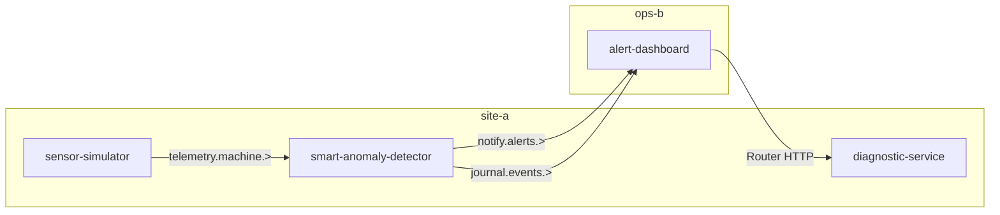

import CliBlock from '@site/src/components/CliBlock';
import CliName from '@site/src/components/flavor/CliName';
import EditPageAdmonition from '@site/src/components/EditPageAdmonition';

# Acme Smart Plant

This example is the plant floor. It does not include fab vision. Vision is [Edge AI wafer defect](/tutorials/edge-ai-wafer-defect).

Four machines (`M001` through `M004`) publish telemetry on **site-a**. Operators on **ops-b** see fleet charts, live alerts, and an event journal. When a fault is open, the dashboard calls **diagnostic-service** on **site-a** through the Router.

Default Edgelet node names are **site-a** and **ops-b**. You can change `agent.name`.

Service images are `ghcr.io/datasance/pot-edge-patterns/<service>:1.2.0`. Use that tag for every service in this example.

Manifests are in [pot-edge-patterns](https://github.com/Datasance/pot-edge-patterns) under `deploy/steps/`. Deploy from that repo root:

<CliBlock>{`{{CLI_NAME}} deploy -f deploy/steps/<file>.yaml`}</CliBlock>

## Topology

```mermaid
flowchart LR
  subgraph siteA [site-a]
    sensor[sensor-simulator]
    detector[smart-anomaly-detector]
    diag[diagnostic-service]
  end
  subgraph opsB [ops-b]
    dash[alert-dashboard]
  end
  sensor -->|telemetry.machine.>| detector
  detector -->|notify.alerts.>| dash
  detector -->|journal.events.>| dash
  dash -->|Router HTTP| diag
```

## NATS subjects {#nats-subjects-and-cross-account-rules}

| Subject | Path |
| --- | --- |
| `telemetry.machine.>` | sensor-simulator to smart-anomaly-detector, then exported for fleet charts |
| `notify.alerts.>` | Live alerts from the detector to the dashboard |
| `journal.events.>` | The same alert kept in JetStream stream `JOURNAL_PRODUCTION` |

The plant account exports those three trees. The operations account imports them. Raw telemetry stays in the plant account until that export exists.

## Flow {#step-index}

| Page | Reader does | Already in place |
| --- | --- | --- |
| [Plant user rules](/tutorials/acme-smart-plant/plant-user-rules) | User rules for the plant microservices | Nodes **site-a** and **ops-b** |
| [Account export](/tutorials/acme-smart-plant/account-export) | Export rule on production-monitoring | |
| [Production monitoring](/tutorials/acme-smart-plant/production-monitoring) | Application on **site-a** | User rules and the export rule |
| [Account public key](/tutorials/acme-smart-plant/account-public-key) | `get nats-accounts`, copy the id | The production-monitoring application, so the account exists |
| [Account import](/tutorials/acme-smart-plant/account-import) | Import rule on operations-center | The copied account id |
| [Diagnostic service](/tutorials/acme-smart-plant/diagnostic-service) | `kind: Service` | diagnostic-service is deployed |
| [Diagnostic bridge port](/tutorials/acme-smart-plant/diagnostic-bridge-port) | `describe service`, copy `bridgePort` | The diagnostic service |
| [Operations center](/tutorials/acme-smart-plant/operations-center) | Application on **ops-b** | The import rule and the bridge port (`DIAGNOSTIC_URL`) |
| [Alert dashboard service](/tutorials/acme-smart-plant/alert-dashboard-service) | `kind: Service` for the dashboard | alert-dashboard is deployed |
| [Fab gallery link](/tutorials/acme-smart-plant/fab-gallery-link) | Optional. Set `SNAPSHOT_URL` on alert-dashboard | Wafer snapshot service is deployed and you have its bridge port |

## Values you copy {#placeholder-cheat-sheet}

| Placeholder | Where you get it |
| --- | --- |
| `<production-monitoring-account-id>` | `get nats-accounts` after production monitoring is deployed |
| `<diagnostic-bridge-port>` | `describe service diagnostic-service` |
| `<dashboard-bridge-port>` | `describe service alert-dashboard` |
| `<snapshot-bridge-port>` | `describe service snapshot-service`, only for the optional gallery link |

You need a control plane on **v3.9.0**, <CliName /> **v3.9.0**, and Edgelet nodes **site-a** and **ops-b**. [Quick start](/get-started/quick-start-local) or [platform deployment](/get-started/deploy/introduction) covers that setup.

<EditPageAdmonition />
