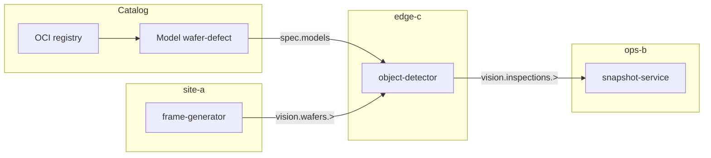

import EditPageAdmonition from '@site/src/components/EditPageAdmonition';

# Edge AI wafer defect

This example is the fab inspection story. It is complete on its own. You do not need the plant example.

**frame-generator** on **site-a** publishes wafer frames. **object-detector** on **edge-c** runs **wafer-defect**. **snapshot-service** on **ops-b** keeps the latest inspection for an HTTP gallery. Subjects are `vision.wafers.>` and `vision.inspections.>`.

You can change `agent.name` if your Edgelet nodes use other names.

Container images are `ghcr.io/datasance/pot-edge-patterns/<service>:1.2.0`. The model repo is `datasance/pot-edge-patterns/models/wafer-defect`, tag `1.2.0`.

Source files: `deploy/steps/13a-model-wafer-defect.yaml` and `deploy/steps/13b-application-vision-inspection.yaml` in [pot-edge-patterns](https://github.com/Datasance/pot-edge-patterns).

## Flow

| Page | Reader does | Already in place |
| --- | --- | --- |
| [OCI registry](/tutorials/edge-ai-wafer-defect/oci-registry) | Registry row, `type: oci`, for GHCR | An Edgelet node you will call **edge-c** |
| [Wafer-defect model](/tutorials/edge-ai-wafer-defect/wafer-defect-model) | `kind: Model` in the catalog | That registry row |
| [Vision user rules](/tutorials/edge-ai-wafer-defect/vision-user-rules) | Three `NatsUserRule` objects | Nothing from the plant |
| [Vision account](/tutorials/edge-ai-wafer-defect/vision-account) | One in-account `NatsAccountRule` | The user rules can exist before or with it. The Application must come after both. |
| [Vision inspection](/tutorials/edge-ai-wafer-defect/vision-inspection) | Application `vision-inspection` | Model catalog row, user rules, account rule. Nodes **site-a**, **edge-c**, **ops-b** (names are overridable). |
| [Snapshot service](/tutorials/edge-ai-wafer-defect/snapshot-service) | `kind: Service` for the gallery | The snapshot-service microservice is deployed |
| [Verify](/tutorials/edge-ai-wafer-defect/verify) | Model is on **edge-c**, inspections arrive, gallery opens | The service |

On vision inspection, `spec.models` names `wafer-defect`. Deploying that microservice makes the Controller attach the model to that Edgelet node and pull it. You do not run `attach model`, and you do not pull the file by hand.

`attach model` for a node with no workload is documented on [AI Model Catalog](/learn/config/ai-model-catalog). This example does not use that command.

## Topology

Weights land at `/models/wafer-defect/wafer-defect.onnx` inside **object-detector**.

The plant floor is a separate example: [Acme Smart Plant](/tutorials/acme-smart-plant).

<EditPageAdmonition />
